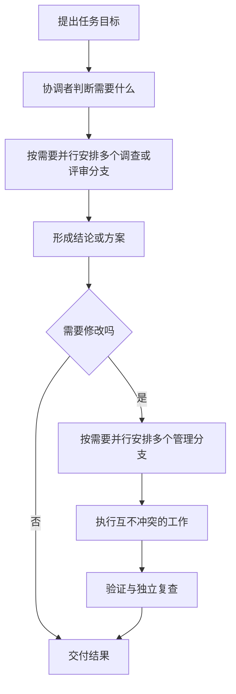

# Codex 全局配置安装包

这是一套给 Codex 使用者的全局配置：统一工作约定、可分工的 agent role，以及常用 skills。安装后，新建的 Codex task 可以直接使用它们。

本项目不安装或升级 Codex CLI，也不安装 Codex 桌面应用。

## 你会得到

- 统一的全局规则和跨平台命令文档。
- 11 个分工角色，用于调查、判断、实施和复查。
- 四个常用 skills：`orchestrate-model-workflow`、`project-doc-planner`、`gpt-image-2-cli` 和 `agent-toolchain`。

## 适合什么时候

适合日常开发、维护多个项目，或希望复杂任务有稳定工作方式的个人和团队。

一般不需要先了解每个角色。直接告诉 Codex 你的目标、范围和限制即可；任务复杂时，它会按需要安排调查、方案、实施和复查。

## 工作流一眼看懂



多个分支可以按任务需要并行；相互影响的工作会顺序处理。

## 安装

Windows（PowerShell 7）：

```powershell
& .\install-codex.ps1
```

macOS 或 Linux：

```sh
sh ./install-codex.sh
```

安装目录优先使用非空的 `CODEX_HOME`；未设置时使用当前用户的 `~/.codex`。安装器会备份它管理的已有内容。完成后重启 Codex 相关程序，或新建 task 以加载新配置。

## 可选能力

`agent-toolchain` 用于为另一个目标项目接入 CodeGraph 与 RTK，适合复杂重构、跨模块理解和大范围排障。在目标项目中对 Codex 说：

> 使用 `$agent-toolchain` 给我安装工具。

单文件或一次性任务通常不需要接入。

联系作者：QQ群 1105515344
