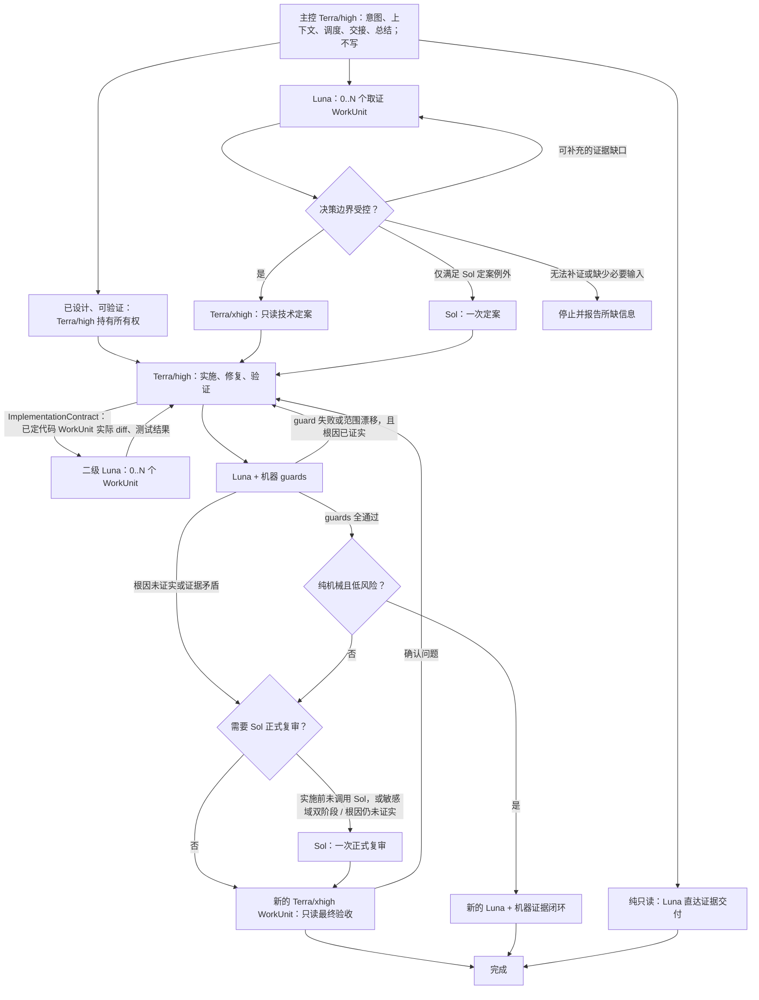

# Codex 全局配置安装包

这个仓库为已经使用 Codex 的开发者提供一套可安装到用户级配置目录的工作环境：统一的行为规范、系统命令文档、可分工的 agent role，以及常用 skills。它帮助团队把重复的执行约定和复杂任务的工作方式沉淀下来，而不是每个项目、每次对话都从头约定。

它不安装或升级 Codex CLI，也不安装 Codex 桌面应用。

## 你会得到什么

| 内容 | 解决什么问题 | 为什么需要它 |
| --- | --- | --- |
| 全局行为规范与系统文档 | 约束文件操作、跨平台命令、SSH 与 `rg` 的使用方式 | 让涉及 Windows、macOS、Linux 或远程主机的任务有可核对的操作边界，降低误执行风险。 |
| 十一个命名 agent role | 将探索、设计、一级实施、二级叶子写入、独立复审和已确认问题修复分开 | 复杂任务由不同角色承担不同责任，避免实现结论直接充当复审结论，同时让规则稳定的工作不必占用最高成本模型。 |
| `orchestrate-model-workflow` | 按任务风险和阶段路由合适的 agent role | 让复杂开发有清楚的探索、实施、复审和验证顺序，而不是只依赖一次生成。 |
| `project-doc-planner` | 规划项目文档、开发规范、环境与资源边界 | 需要建立或整理项目文档体系时，先明确哪些内容应公开、应落盘或只保留在本地。 |
| `gpt-image-2-cli` | 使用当前 Codex 的认证和 provider 配置调用 `gpt-image-2` | 需要生成图像时，无须为同一套配置再手动复制 API key。 |
| `agent-toolchain` | 为另一个目标项目接入 CodeGraph 与 RTK | 当任务需要理解跨模块关系或反复读取大量只读命令输出时，减少无关信息进入 AI 上下文。详见后文。 |

## 何时值得安装

适合希望把 Codex 用于日常开发、维护多个项目，或需要稳定执行规范的个人和团队。安装后，新的 Codex task 会获得统一的工作约定、skills 和命名角色。

如果只想临时运行一个小脚本，或尚未安装和使用 Codex，本仓库不会替代 Codex 本体，也未必值得额外配置。`agent-toolchain` 更适合复杂重构、跨模块理解、架构分析、大范围排障或频繁查看大输出的项目；单文件、小型或一次性任务通常不需要先接入它。

## 多模型工作流：单一权威、按边界路由

运行时规则唯一来源是 [`skills/orchestrate-model-workflow/SKILL.md`](/F:/ai-vibecode-superpower/skills/orchestrate-model-workflow/SKILL.md)。主控（`gpt-5.6-terra` / `high`）只负责意图、必要上下文、调度、显式交接和总结，不写工作区。纯只读任务直达 Luna 并交付证据；已完成设计、所有权明确且可验证的实现，由 `Terra/high` 持有一级责任并优先拆成 `ImplementationContract` 交给 Luna 写代码；有界技术路径只在需要时使用 `Terra/xhigh` 定案并保留一次新的最终验收。Sol 只处理明示的高风险或高不确定例外，高影响本身不会自动触发 Sol。



| 角色 | 负责什么 | 为什么不会把关键判断降级 |
| --- | --- | --- |
| Luna（只读） | 纯只读任务直达交付事实与证据；实施后做预审。 | 没有静态数量上限，但每个 WorkUnit 都要有互补证据域、固定输入和新增价值。 |
| Sol | 只处理权限、安全/隐私、数据完整性、竞态、不可逆外部副作用、公共契约/跨模块重设计、无可靠 oracle 或证据矛盾。 | 默认每任务只在定案或正式复审之一调用一次；高影响本身不触发。 |
| `avsp_terra_high` | 唯一一级实施与修复负责人，负责把设计转成 `ImplementationContract`、持有一级责任、验证、审核二级 Luna 结果并集成。 | 主控只调度和交接；同一写入目标始终只有一个 owner。 |
| Terra/xhigh | 始终只读，负责必要的有界技术定案和新的最终验收。 | 有界路径不重复调用复审和验收。 |
| Luna writer | 仅作为 `Terra/high` 的直接二级子代理，实施拥有完整契约的代码 WorkUnit；可写生产逻辑、公共接口或 schema、迁移脚本、共享状态或并发相关实现。 | 不能自行补全未交接的设计或抢占所有权；契约缺口、冲突或未预期验证失败时停止并交回 Terra。 |

边界受控只表示证据充分、范围清楚、风险可解释、验收可观察；证据仍可补充时回到 Luna，无法补证或缺少必要输入时停止并报告，任何角色都不得猜测后强行沿低成本路径完成。Luna 是否可以写不是由“是不是生产代码”决定，而是由 `ImplementationContract` 决定：契约必须写明已定行为、允许目标与唯一所有权、不变量或顺序约束、适用的领域边界/精度/失败语义、示例、验证和停止条件。低风险闭环必须记录契约/实际 diff、输入状态哈希、确定性检查、可重建生成物，以及 Luna 与机器证据的一致性；guard 失败或范围漂移先由 `Terra/high` 在原契约内修复，根因未证实或证据矛盾才判断 Sol 正式复审。每个阶段通过 `HandoffPacket` 显式交接 `work_id`、目标、范围与非目标、状态、输入/产物引用、可验证结果与证据、`guard_results`、未覆盖行为、升级原因、风险/未知项和下一阶段请求；写入或并发时再附加 `ImplementationContract`、所有权、依赖、验收和集成负责人。上下文默认最小充分，只有会改变判断的近期历史才附加。

### 什么时候优于直接使用 Sol

| 任务属性 | 直接使用 Sol | 使用工作流 |
| --- | --- | --- |
| 只读取证、无写入或技术定案 | 额外调用没有收益。 | 直达 Luna，交付证据并停止。 |
| 设计和规则完整、所有权明确、验收可观察 | 通常更快，额外协调没有收益。 | `Terra/high` 形成契约并优先下放互斥代码 WorkUnit；低风险 guards 全通过时新的 Luna + 机器证据闭环。 |
| 范围局部、证据充分、验收明确 | 会把低判断密度工作也放到 Sol。 | Luna 取证后仅在需要时由 `Terra/xhigh` 定案，`Terra/high` 实施，再经一个新的最终验收。 |
| 满足明示的安全、数据、竞态、不可逆副作用、公共契约/重设计、无 oracle 或证据矛盾条件 | 需要独立判断，但不应同时承担写入。 | 在不确定性出现处一次调用 Sol 定案或正式复审；只有敏感域双阶段判断或根因仍未证实时升级。 |
| 根因仍未证明或重要问题多轮未解决 | 需要重新审视原有假设。 | 升级到 `Sol/xhigh` 重新设计，再进入范围受控的 `Terra/high` 修复和 `Terra/xhigh` 验收。 |

### 成本：复杂任务中的实测优势与适用边界

以下观察来自用户提供的运行记录：此前近 300 次复杂任务调度中，Luna/Terra/Sol 调度次数约为 60%/30%/10%。在这一复杂任务样本、当前编排，以及“同类任务直接使用 Sol”为对照的口径下，实测成本为直接使用 Sol 的 1/5 至 1/10，约有 5-10 倍成本优势，即节省约 80%-90%。在后续约 1 万次非常复杂任务调度的观察中，成本接近直接使用 Sol 的 1/10，约节省 90%。这些是特定复杂任务、当前编排和直接 Sol 对照口径下的观察，不是任意任务的固定保证。

下表为用户提供的当前价格，计价单位未注明：

| 模型 | 基准输入（普通未缓存） | 缓存写入（1.25x 基准输入） | 缓存读取（0.1x 基准输入） | 输出价格 |
| --- | --- | --- | --- | --- |
| GPT-5.6 Sol（标准） | $5.00 | $6.25 | $0.50 | $30.00 |
| GPT-5.6 Terra（新版降价后） | $2.00 | $2.50 | $0.20 | $12.00 |
| GPT-5.6 Luna（新版降价后） | $0.20 | $0.25 | $0.02 | $1.20 |

按上述用户提供的当前价格，缓存读取按基准输入的 0.1x、即原价 10% 计费，等于 90% 折扣；缓存写入按基准输入的 1.25x 计费，比基准输入高 25%。计价单位未注明。

成本下降的机制是职责分工，而不是让每一步都使用 Sol：纯只读取证直达 Luna；低复杂度定案和语义路径的最终验收由只读 `Terra/xhigh` 完成；Sol 保留给明示例外并默认只调用一次；对已经完成设计的多数实现，`Terra/high` 形成契约、Luna writer 写实际代码、Terra 审核并集成。这样把重复实现从 Terra 与 Sol 移开，同时把判断仍保留在设计、例外和验收环节；不能从调度次数直接计算出上述实测倍数。

调度次数占比不等于 token 或成本占比。实际成本还受每个角色的输入/输出 token、缓存写入与命中读取、重试、并行分支、复审轮次、fallback，以及直接 Sol 基线的同等任务范围、完成质量、验收标准和计量边界影响。因此，成本结论应持续在同类任务和固定验收口径下记录与复核。

## 安装

Windows（PowerShell 7）：

```powershell
& .\install-codex.ps1
```

macOS 或 Linux：

```sh
sh ./install-codex.sh
```

安装目录优先使用非空的 `CODEX_HOME`；未设置时使用当前用户的 `~/.codex`。安装完成后请重启 Codex 相关程序，使新进程加载更新后的配置。

### 安装过程与安全边界

安装器会先校验来源内容，再在暂存目录准备候选配置；只有全部检查通过后才写入目标目录。已有受管理内容会统一备份到 `<CODEX_HOME>/backups/` 下的唯一目录；若安装中任一步失败，安装器会尝试恢复备份。

它会安装或更新本仓库受管理的 `AGENTS.md`、合并后的 `config.toml`、`docs/`、十一个 agent role 和四个 skills。它不会替换用户自有 role，也不会移动、删除或备份未受管理的 skill；不会读取、输出或复制认证信息。

为了避免不确定地改写配置，安装器只合并可安全解析的 `config.toml`。遇到多行字符串、跨行 value、歧义 table header 或受管理键的 quoted/dotted 写法等无法证明无损改写边界的输入时，会在备份和写入前停止，并报告 `unsupported TOML syntax for safe merge`。Windows 安装器拒绝穿过符号链接或目录联接的 `CODEX_HOME` 路径；macOS/Linux 安装需要 `rg` 用于安全扫描，且两种安装器都会阻止同一目标目录的并发安装。

安装会将默认主控设置为 `gpt-5.6-terra` / `high`，并保留现有 `config.toml` 中未由本仓库管理的设置。安装成功只证明配置已安全写入，不能保证当前 provider 支持全部固定 role；实际任务只能使用工作流规定且可验证的 fallback，无匹配 fallback 的必需 role 会以 `MODEL_UNAVAILABLE` 停止。

## 可选：为目标项目接入 CodeGraph 与 RTK

`agent-toolchain` 是给**另一个需要增强的目标项目**使用的 skill，不是本仓库已经初始化的示例。它受控地安装、初始化、诊断和维护两项工具：CodeGraph 与 RTK。

| 工具 | 它能做什么 | 它不负责什么 |
| --- | --- | --- |
| CodeGraph | 通过 MCP 提供跨模块依赖、调用链和影响范围的索引查询，帮助 AI 在大型代码库中定位相关代码。 | 它的索引不是源码事实；刚修改或未跟踪的文件仍要以当前源码和 `rg` 交叉核实。 |
| RTK | 压缩已验证的只读高输出命令结果，例如 `git`、`rg`、`log`、`diff`、`test`、`npm` 或 `pnpm`。 | 它不是安全边界，不执行写操作、部署、迁移、权限或密钥操作，也不替代需要原始输出的精确排障。 |

### 为什么它可能节省 token

大型仓库的依赖关系和只读命令输出常常很长。CodeGraph 让 AI 针对关系和影响范围查询，而 RTK 会压缩适用的只读高输出结果；因此进入模型上下文的重复路径、日志和列表可能更少。

这是一种减少输入内容的机制，不是固定的 token 节省承诺。实际收益取决于命令、输出量和任务；仓库没有提供节省比例或性能基准。复杂推理、写操作和需要完整原始输出的诊断不会因为 RTK 而自动变少或被替代。

### 如何接入

在需要接入的目标项目中，直接对 Codex 说：

> 使用 `$agent-toolchain` 给我安装工具。

skill 会按受控流程完成配置预检、安装前 dry-run、受管工具安装、索引初始化和健康检查。接入过程会：

1. 写入目标项目 `.codex/config.toml` 中的 CodeGraph MCP、根 `.gitignore` 的 `/.codegraph/`，以及根 `AGENTS.md` 的两条 AI 路由。
2. 安装并验证受管的 CodeGraph 与 RTK，然后建立或增量同步 CodeGraph 索引；`.codegraph/` 是本地缓存，不提交到版本库。
3. 运行 `doctor`、`codegraph status` 和一次可核对查询，确认工具入口和索引状态。

如果已有配置与受控内容冲突，skill 会停止，不覆盖用户内容。它需要可执行的 `node` 与 `npm`，并需要网络访问相应的软件源；会保留已有 npm registry 或代理配置。支持 macOS/Linux 的 arm64 和 x64，以及 Windows x64；Windows arm64 不支持整套工具链。

### 接入后会怎样

日常使用中，你不需要手动定期同步索引。面对复杂重构、跨模块理解、架构分析或大范围排障时，AI 会按需检查工具状态；CodeGraph MCP 会监听文件变更，并在重新连接时补齐离线修改。工具不会自动升级。

这不意味着每个任务都会调用工具，也不代表任何状态都能自动恢复。`doctor`、CodeGraph MCP 或 `codegraph status` 明确报告异常时，AI 才会执行一次相应的恢复操作。MCP 配置变更通常需要新建 Codex task 或重启客户端后才能加载。

## 目录结构

```text
.
├── install-codex.ps1
├── install-codex.sh
├── codex-global-config/
│   ├── AGENTS.md
│   ├── agents/
│   │   ├── ai-vibecode-superpower.sha256
│   │   └── ai-vibecode-superpower/
│   │       └── ai-vibecode-superpower-avsp_*.toml
│   ├── config.toml
│   └── docs/
│       ├── README.md
│       └── system/
│           ├── README.md
│           ├── windows.md
│           ├── macos.md
│           ├── linux.md
│           ├── ssh.md
│           ├── rg.md
│           └── 跨系统操作示例.md
└── skills/
    ├── gpt-image-2-cli/
    ├── orchestrate-model-workflow/
    ├── project-doc-planner/
    └── agent-toolchain/
```

## 维护者说明

`codex-global-config/` 是安装来源目录，不会原样复制：其中的 `AGENTS.md`、`config.toml`、`docs/` 与 agent role 会分别写入 Codex 全局目录。`config.toml` 只更新本仓库管理的 `model`、`model_reasoning_effort`、`agents.max_threads`、`agents.max_depth`、`features.js_repl` 和 `features.goals`，其余设置会保留。

维护本仓库时，跨任务行为保留在 `codex-global-config/AGENTS.md`，工作流的唯一运行时规范保留在 `skills/orchestrate-model-workflow/SKILL.md`，平台与命令规范保留在 `codex-global-config/docs/`，references 与 README 只作说明或模板。不要在这个安装包仓库中重新创建被忽略的 `.codex/` 目录；需要接入 CodeGraph/RTK 的应是另一个目标项目。

安装器备份的内容包括已有的 `AGENTS.md`、`config.toml`、`docs/`、受管理 role 和受管理 skill。安装成功后备份会保留，便于人工恢复；若恢复中有单个目标失败，安装器仍会继续恢复其余目标并报告失败项。未管理 skill 始终不受影响。
