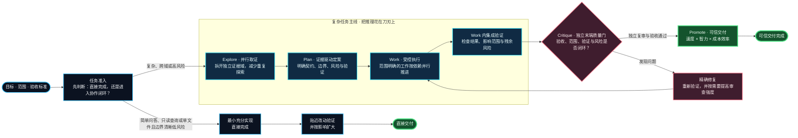

# ai-vibecode-superpower

> 把 Codex 与 ZCode 从“单次对话工具”升级为一套面向复杂开发的工程协作系统：**更快推进、更强判断、更少浪费**。

`ai-vibecode-superpower` 是可安装的 Codex / ZCode 配置包。它为复杂开发建立可追溯的取证、执行、验证与独立复查闭环；小任务仍然保持直接、轻量，不为工作流而工作流。两个宿主共享同一套平台文档和通用 skills；全局指令、agent 角色、工作流变体和安装行为的差异通过 `codex-global-config/` 与 `zcode-global-config/` 目录隔离。

## 你真正得到的提升

| 你关心的事 | 系统如何做到 | 结果是什么 |
| --- | --- | --- |
| **速度** | 可拆分的取证与准备工作并行推进；依赖满足后立刻进入下一节点。 | 减少等待串行链路，让复杂任务更快收敛。 |
| **智力** | 先用证据缩小问题，再把高强度判断留给真正复杂、冲突或高风险的决策。 | 不是“多想一点”，而是让推理聚焦在最值得推理的地方。 |
| **成本** | 范围明确的扫描、整理和可验证执行使用更经济的路径；高成本复审按风险升级。 | 降低重复探索与不必要的高强度推理消耗。 |
| **可靠性** | 协作闭环中的复杂任务保留目标、交接、验证和审核证据；直接任务保留实际结果和验证证据，有改动时附 diff。 | 结论可核对，未验证的风险不会被包装成完成。 |

以上收益取决于任务规模、可拆分程度、代码库质量和验证条件。一次性小改动通常直接完成，不会强行引入额外协作成本。

## 工作流概览



复杂任务用 `Explore → Plan → Work → Critique → Promote` 表达主线：`Explore` 是取证，`Plan` 是定案与契约，`Work` 包含实施和集成验证，`Critique` 是独立复审，`Promote` 仅表示在验收通过后允许可信交付，不授权额外发布或部署。简单问答、只读查询或单文件且边界清晰低风险的直接任务不进入该闭环；有改动时运行贴近改动、再按影响扩大的验证后交付。

这不是“多开几个 agent”。它是一套明确分工的工程闭环：低成本工作尽量并行和复用，高强度判断只在证据不足、风险上升或需要独立复查时介入；每次交付都要经过与任务风险相称的验证。

`orchestrate-model-workflow` 是 standalone skill，只提供行为级路由和质量门建议；宿主（Codex 或 ZCode）原生负责 agent 创建、通信、等待和汇总，不引入额外控制平面。

## 适合什么场景

| 场景 | 推荐方式 |
| --- | --- |
| 单文件、改法明确、低风险调整 | 直接完成并运行贴近改动的验证。 |
| 跨文件实现、未知根因、需要扫描大型代码库 | 用并行取证和证据驱动定案，减少盲目修改。 |
| 多模块改造、共享状态、外部副作用或高回归风险 | 使用工作流 skill 的受控写入与任务级质量门。 |
| 需要反复交接或独立验收 | 由宿主原生 agent 协作并保留可核对证据。 |

## 快速安装

每个平台一个安装器：`install.ps1`（Windows）与 `install.sh`（macOS/Linux）。直接运行后按提示交互选择客户端（Codex / ZCode），或在命令中直接指定客户端跳过交互；共享内容由所选客户端的安装流程一并安装，宿主专属内容各装各的。新增客户端时在两个安装器的客户端注册表中加入一项即可。

### Codex

前置条件：

- macOS/Linux 还需要 `rg`（ripgrep）。
- 安装前完全退出 Codex Desktop；否则运行中的应用可能把配置覆盖回去。

安装器会解析当前用户的 Codex home，再把全局文档中的路径占位符替换为绝对路径；已安装的 `AGENTS.md` 和 `docs/` 不依赖模型展开环境变量。安装失败时会尝试从本次安装生成的备份恢复；名称不匹配、符号链接或 junction 内容不会删除。备份目录由安装器输出，清理策略由维护者另行管理。

这是全新的 standalone 工作流安装布局，不迁移或卸载任何旧版 plugin、skill、cache 或 state；如本机仍有旧版，请由用户先自行卸载。

**Windows（PowerShell 7）**，在仓库根目录运行：

```powershell
& .\install.ps1 -Client codex
```

**macOS 或 Linux**：

```sh
sh ./install.sh codex
```

安装前先完整退出所有 Codex Desktop 窗口，并确认其 `app-server` 进程已经结束，避免活动进程把配置覆盖回去。安装成功后完全重启 Codex Desktop 或 Codex CLI 进程，并在新会话中使用 standalone skill。若使用 CC-Switch，请确认它没有覆盖安装脚本写入的 Codex 配置。

如果安装时未退出应用，或配置看起来没有生效，可核对以下配置是否仍存在：

```toml
model = "gpt-5.6-terra"
model_reasoning_effort = "high"
sandbox_mode = "danger-full-access"

[agents]
max_threads = 1000
max_depth = 5

[features]
goals = true
```

### ZCode

- 安装前退出 ZCode 会话；安装成功后重启 ZCode，使 `~/.zcode/agents` 的角色和 `~/.zcode/skills` 生效。
- ZCode 变体包含 5 个角色，按统一公式 `模型_版本_类型_思考档` 命名：`glm_5.3_flash_low`（常规取证）、`glm_5.3_flash_high`（深度取证）、`glm_5.3_flash_max`（写代码主力）、`glm_5.3_high`（审核主力）、`glm_5.3_max`（终审）；GLM-5.3 不使用 low 档。`gpt-image-2-cli` 是 Codex 专属，不会安装到 ZCode。
- 安装器只管理 `AGENTS.md`、`docs/`、`agents/ai-vibecode-superpower/` 和受管的 skills；不修改 ZCode 的 `cli/`、`v2/`、插件缓存或用户自建的其它 skills/agents。已有的 `AGENTS.md` 会先备份再替换。

**Windows（PowerShell 7）**，在仓库根目录运行：

```powershell
& .\install.ps1 -Client zcode
```

**macOS 或 Linux**：

```sh
sh ./install.sh zcode
```

## 使用方式与可选能力

安装并重启后，直接在目标项目描述目标、范围和限制即可。复杂任务会根据实际需要进入协作闭环；不需要时保持轻量。

| 能力 | 何时使用 | 你会得到 |
| --- | --- | --- |
| [`agent-toolchain`](shared/skills/agent-toolchain/SKILL.md) | 首次接入、升级、修复、维护或审查 CodeGraph/RTK | 对目标项目进行受控接入与维护。 |
| [`orchestrate-model-workflow`](codex-global-config/skills/orchestrate-model-workflow/SKILL.md) | 跨文件实现、复杂取证或独立验收 | 按证据和风险选择 role，并保留可核对的验证闭环。 |
| [`project-doc-planner`](shared/skills/project-doc-planner/SKILL.md) | 新项目或大型改造的文档规划 | 可维护的项目级文档结构。 |
| [`gpt-image-2-cli`](codex-global-config/skills/gpt-image-2-cli/SKILL.md) | 需要生成或编辑图片素材 | 通过命令行调用图像生成能力。 |

`orchestrate-model-workflow` 是双变体 skill：Codex 版与 ZCode 版按宿主机制差异分离维护，ZCode 版见 [`zcode-global-config/skills/orchestrate-model-workflow/SKILL.md`](zcode-global-config/skills/orchestrate-model-workflow/SKILL.md)。

例如：“使用 `$agent-toolchain` 给这个项目接入工具链”，或“使用 `$orchestrate-model-workflow` 组织这个复杂任务”。工具链接入完成后，普通开发不需要再次触发 `$agent-toolchain`。

## 进一步阅读

- [`orchestrate-model-workflow`（Codex 版）](codex-global-config/skills/orchestrate-model-workflow/SKILL.md) / [（ZCode 版）](zcode-global-config/skills/orchestrate-model-workflow/SKILL.md)：工作流路由、交接与验收规范。
- [agent role profiles（Codex）](codex-global-config/agents/ai-vibecode-superpower/) / [（ZCode）](zcode-global-config/agents/ai-vibecode-superpower/)：role 的本地权限与输出边界。
- [统一安装器：Windows](install.ps1) / [macOS/Linux](install.sh)（交互选择或指定 `codex` / `zcode` 客户端）。

问题或建议：QQ群 `1105515344`
