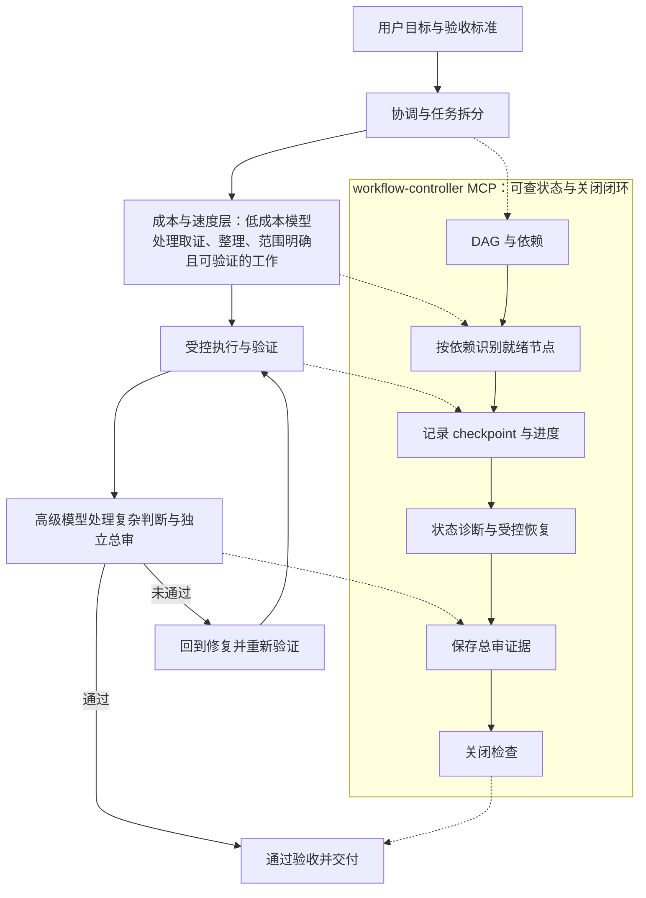

# ai-vibecode-superpower

## 定位与注意事项

本项目是面向 Codex 使用者的可安装配置包，提供全局规则与文档、agent role profiles，以及 `agnets-workflow` 插件和若干独立 skill。它帮助复杂开发任务建立更清晰的调查、实施和复查工作方式。

本项目不安装或升级 Codex CLI，也不安装 Codex Desktop。若已启用同类 `superpowers` 插件，请先禁用它，以避免潜在的规则冲突和额外使用成本。

## 你会得到

- 可供 Codex 使用的全局规则与跨平台文档。
- 默认引导 Codex 根据任务复杂度选择最小充分实现和适当的答复密度。
- 可按任务需要使用的 agent role profiles。
- `agnets-workflow` 插件及其工作流工具。
- `agent-toolchain` 提供 CodeGraph 与 RTK 的项目受控接入与维护。
- 独立全局 skill：`project-doc-planner` 与 `gpt-image-2-cli`。

## 适合什么时候

适合日常开发与维护，尤其是需要跨文件理解、分阶段实施、并行处理或独立复查的复杂任务。单文件、一次性的小改动通常不需要额外配置；安装完成后，直接告诉 Codex 目标、范围和限制即可。

## 成本预期

对于可拆分的复杂任务，工作流可减少高成本推理和重复探索；实际收益取决于任务规模、上下文和重试。对于跨模块理解、大型代码库或重复探索明显的场景，已接入的 CodeGraph 与 RTK 可辅助查询和筛选；一次性小改动通常不适合为此专门接入。

成本优化不会省略验证；无法安全拆分或证明可恢复时，工作流保持保守执行。

## 工作流概览



MCP 不是替代 Codex agent 的调度器；它把任务进度、依赖、checkpoint、审核证据和关闭门禁持久化为可查、可恢复的状态。

### workflow-controller MCP 如何支撑闭环

| 机制 | 用户看到的结果 |
| --- | --- |
| DAG/依赖 | 可并行且按顺序交接 |
| checkpoint/状态诊断 | 中断后有可核对的恢复线索 |
| 工作区状态与关闭检查 | 未满足验收不得作为已完成交付 |
| 总审证据 | 高级独立复查有据可查 |

上述机制由 [`agnets-workflow` 使用说明](plugins/agnets-workflow/README.md) 和 [`workflow-controller` 工作流控制器](plugins/agnets-workflow/skills/workflow-controller/SKILL.md) 支持。

## 快速安装

### 前置条件

- 已安装并可运行的 Codex CLI。
- Node.js `>=22.5.0`（工作流控制器使用原生 `node:sqlite`）。
- macOS/Linux 还需要 `rg`（ripgrep）。
- 关闭codex Desktop  必须否则配置会被覆盖回去

安装目标优先使用非空的 `CODEX_HOME`；未设置时使用 `~/.codex`。
安装器只在成功安装后清理自己生成的旧备份，并保留最近 5 份；名称不匹配、符号链接或 junction 内容不会删除。

### Windows（PowerShell 7）

在仓库根目录运行：

```powershell
& .\install-codex.ps1
```

### macOS 或 Linux

在仓库根目录运行：

```sh
sh ./install-codex.sh
```

安装成功后，必须完全重启 Codex Desktop 或 Codex CLI 进程，使新增配置与能力生效。


如果本地使用了 CC-Switch，需确认它没有覆盖安装脚本写入的 Codex 配置。


> 检查配置 , 如果缺少自己补充  因为安装的时候可能因为你没有提前关闭软件导致配置被覆盖回去了

```toml
model = "gpt-5.6-terra"
model_reasoning_effort = "high"
sandbox_mode = "danger-full-access"


[plugins."agnets-workflow@ai-vibecode-superpower-local"]
enabled = true

[agents]
max_threads = 1000
max_depth = 5

[features]
goals = true


```


## 使用方式与可选能力

安装并重启后，在目标项目中直接描述任务即可。需要特定能力时，可以明确提及对应 skill：

| 能力 | 适用场景 | 说明 |
| --- | --- | --- |
| [`agent-toolchain`](plugins/agnets-workflow/skills/agent-toolchain/SKILL.md) | 首次接入、配置修复、索引维护、健康检查、升级审查或回滚 | 受控配置 CodeGraph/RTK，并在目标项目 `AGENTS.md` 写入统一的 `## CodeGraph 与 RTK` 规则；日常开发直接遵守该项目规则。 |
| [`workflow-controller`](plugins/agnets-workflow/skills/workflow-controller/SKILL.md) | 需要持久化状态和可恢复交接的复杂任务 | 管理任务状态、就绪节点、checkpoint 与收口检查。 |
| [`project-doc-planner`](skills/project-doc-planner/SKILL.md) | 新项目或大型改造的文档规划 | 生成和维护项目级文档结构。 |
| [`gpt-image-2-cli`](skills/gpt-image-2-cli/SKILL.md) | 需要生成或编辑图片素材 | 通过命令行调用图像生成能力。 |

例如，可以说：“使用 `$agent-toolchain` 给这个项目接入工具链”，或“使用 `$workflow-controller` 管理这个任务”。工具链接入完成后，不需要为普通开发再次触发 `$agent-toolchain`。是否需要这些能力，应以任务范围为准。

## 进一步阅读

- [`agnets-workflow` 使用说明](plugins/agnets-workflow/README.md)
- [`orchestrate-model-workflow` 工作流规范](plugins/agnets-workflow/skills/orchestrate-model-workflow/SKILL.md)
- [agent role profiles](codex-global-config/agents/ai-vibecode-superpower/)
- [macOS/Linux 安装脚本](install-codex.sh)
- [Windows 安装脚本](install-codex.ps1)

问题或建议：QQ群 `1105515344`
