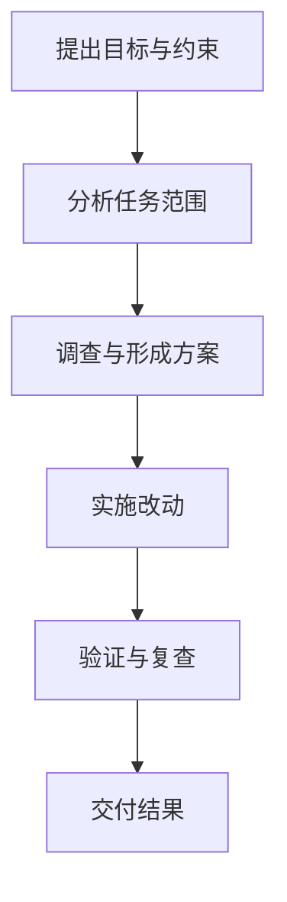

# ai-vibecode-superpower

## 定位与注意事项

本项目是面向 Codex 使用者的可安装配置包，提供全局规则与文档、agent role profiles，以及 `agnets-workflow` 插件和若干独立 skill。它帮助复杂开发任务建立更清晰的调查、实施和复查工作方式。

本项目不安装或升级 Codex CLI，也不安装 Codex Desktop。若已启用同类 `superpowers` 插件，请先禁用它，以避免潜在的规则冲突和额外使用成本。

## 你会得到

- 可供 Codex 使用的全局规则与跨平台文档。
- 可按任务需要使用的 agent role profiles。
- `agnets-workflow` 插件及其工作流工具。
- 独立全局 skill：`project-doc-planner` 与 `gpt-image-2-cli`。

## 适合什么时候

适合日常开发与维护，尤其是需要跨文件理解、分阶段实施、并行处理或独立复查的复杂任务。单文件、一次性的小改动通常不需要额外配置；安装完成后，直接告诉 Codex 目标、范围和限制即可。

## 工作流概览



任务会根据实际范围选择必要步骤；上图只展示常见路径，不代表固定的执行方式。

## 快速安装

### 前置条件

- 已安装并可运行的 Codex CLI。
- Node.js `>=20`。
- macOS/Linux 还需要 `rg`（ripgrep）。

安装目标优先使用非空的 `CODEX_HOME`；未设置时使用 `~/.codex`。

### Windows（PowerShell 7）

在仓库根目录运行：

```powershell
& .\install-codex.ps1
```

### macOS 或 Linux

在仓库根目录运行：

```sh
sh ./install-codex.sh
```

安装成功后，必须完全重启 Codex Desktop 或 Codex CLI 进程，使新增配置与能力生效。

## 使用方式与可选能力

安装并重启后，在目标项目中直接描述任务即可。需要特定能力时，可以明确提及对应 skill：

| 能力 | 适用场景 | 说明 |
| --- | --- | --- |
| [`agent-toolchain`](plugins/agnets-workflow/skills/agent-toolchain/SKILL.md) | 复杂重构、跨模块理解和大范围排障 | 为目标项目接入 CodeGraph 与 RTK。 |
| [`workflow-controller`](plugins/agnets-workflow/skills/workflow-controller/SKILL.md) | 需要持久化状态和可恢复交接的复杂任务 | 管理任务状态、就绪节点、checkpoint 与收口检查。 |
| [`project-doc-planner`](skills/project-doc-planner/SKILL.md) | 新项目或大型改造的文档规划 | 生成和维护项目级文档结构。 |
| [`gpt-image-2-cli`](skills/gpt-image-2-cli/SKILL.md) | 需要生成或编辑图片素材 | 通过命令行调用图像生成能力。 |

例如，可以说：“使用 `$agent-toolchain` 给这个项目接入工具链”，或“使用 `$workflow-controller` 管理这个任务”。是否需要这些能力，应以任务范围为准。

## 进一步阅读

- [`agnets-workflow` 使用说明](plugins/agnets-workflow/README.md)
- [`orchestrate-model-workflow` 工作流规范](plugins/agnets-workflow/skills/orchestrate-model-workflow/SKILL.md)
- [agent role profiles](codex-global-config/agents/ai-vibecode-superpower/)
- [macOS/Linux 安装脚本](install-codex.sh)
- [Windows 安装脚本](install-codex.ps1)

问题或建议：QQ群 `1105515344`
