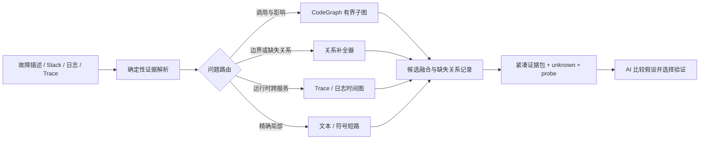

# 因果诊断器真实项目可行性验证

> 验证日期：2026-08-28  
> 状态：首轮检索层可行性验证完成；M-1 benchmark harness 与真实 runner 已实现；主 Spike 覆盖 7 个 Bug、3 个仓库和全部 6 类问题，另有 8 个独立候选完成补充 runner 验证，但正式盲测门禁尚未完成。  
> 结论：**不批准直接实现完整插件；批准进入有边界的验证性 Spike。**

## 1. 结论

真实项目验证说明，这个方向有可测量的价值，但原方案中“CodeGraph 生成全局图，再把模糊问题直接映射到图上”的入口不可靠。

当前产品决策为 **No-Go（不进入完整插件实现）**。Benchmark evaluator 的多次报告显示 `insufficient_data`，表示正式统计前置条件未满足；同时 cross-service Spike 出现高置信错误根因，因此即使只看方向性信号，也不能把当前静态证据管线升级为面向用户的全局根因定位能力。

- CodeGraph 适合提供已有健康索引上的符号、调用和依赖关系，不适合单独承担模糊自然语言到根因范围的召回和排序。
- 精确、局部的 SQL 问题使用确定性文本/符号检索即可命中；强行扩图会增加噪声和上下文。
- 跨文件 EPIPE 问题的决定性信息不是普通调用关系，而是“哪些 SSE 响应面缺少本地 `error` 边界”。缺失关系不是现有图中的边，必须由关系补全器显式发现。
- 在修复前快照上，SSE 生命周期补全器与 CodeGraph 调用关系结合后，在约 `367 ms` 内覆盖 5/5 个修复前已存在的生产根因文件，证据包约为 `760 token` 代理值。
- 同一规则在修复后快照上能沿 CodeGraph 调用边识别共享错误边界，未再报告未保护的 SSE 响应面；只做单文件关键词判断时会误报。

早期检索验证只能证明“检索和关系补全层值得继续验证”。第 16 至 17 节以及后续补充 Spike 已提供实际 token、首次正确根因时间和跨服务高置信错误的可复核信号；累计探索覆盖全部 6 类问题，但样本仍不足 20 个 Bug，缺少 3 次重复和修复后回归，因此尚无足够证据声称插件能够普遍降低 AI 错误率、实际 token 账单或端到端修复时间。

## 2. 验证目标与边界

本轮验证回答四个问题：

1. 健康 CodeGraph 索引能否在秒级提供候选上下文；
2. 候选上下文是否覆盖真实修复范围，而不只是返回相关文件；
3. 关系补全器能否发现 CodeGraph 普通调用图遗漏的关键关系；
4. 交给 AI 的证据量是否有下降空间。

第 16 至 17 节累计完成 7 个 Bug、3 个仓库的一次重复模型盲测；第 20 至 24、26 至 27 节以及新增的 tool-search-template 候选又完成 8 个独立候选的 runner 验证（其中若干 baseline 因工具上限或超时未完成），但未完成正式规模、同一 gate suite 和重复稳定性验证，因此不把下列内容写成普遍事实：

- AI 根因判断错误率下降；
- 端到端“首次正确根因时间”下降；
- API 实际 input/output/cache token 或费用下降；
- 对 CodeGraph 全部支持语言和不同框架具有相同收益。

文中的 `token 代理值` 统一使用 `ceil(字符数 / 4)`，只用于比较证据包体积，不等于模型 tokenizer 结果或账单 token。不同路径的包结构并不完全相同，因此这些数字只说明数量级和压缩空间，不是严格的模型上下文 A/B。关系补全原型的 `760 token` 主要是结构化文件/关系信息，尚未包含最终 AI 可能需要的全部源码片段，实际输入一定会更大。

## 3. 项目与真实 Bug

验证项目为本机真实仓库 `sub2api-lite`。实验只读取 Git 历史，并通过 `git archive` 在临时目录生成固定快照；没有切换分支、创建 worktree 或修改目标仓库。

### 3.1 EPIPE / SSE 跨文件故障

- 修复提交：`08e9b352cb4e219b9a7a133be4c8f8996e2791c7`
- 修复前快照：`4c96885e1a8c8907e1f92abf457b6a422dc69070`
- 症状描述：下游客户端断开后，SSE 响应触发 `EPIPE`，错误进入进程级 fatal handler。
- 修复规模：13 个文件，369 行新增、24 行删除，包含生产代码和回归测试。

修复前已存在的 5 个生产真值文件为：

```text
backend/src/modules/chat/chat.routes.ts
backend/src/modules/gateway/routes.ts
backend/src/modules/model-checks/model-checks.routes.ts
backend/src/shared/logger.ts
backend/src/shared/process-fatal-diagnostic.ts
```

修复提交还新增 `backend/src/shared/downstream-response-error-boundary.ts`。该文件在修复前不存在，不能作为检索召回率的分母；诊断器最多只能提出“应抽取共享边界”的修复建议，不能检索一个尚不存在的节点。

### 3.2 审计日志 SQL 单文件故障

- 修复提交：`62c53262a220e044f0a3dd553c44c9bd981ce9ad`
- 修复前快照：`fcec1a899cc68ab328eac976964053c94e4b95eb`
- 症状描述：审计日志 upsert 的 `WHERE lifecycle_status = 'in_progress'` 存在字段限定问题。
- 真值文件：`backend/src/storage/audit-logs.repository.ts`
- 修复规模：1 个文件，1 行替换。

该样本用于验证“简单问题是否应跳过全图扩散”。

## 4. 环境与索引

| 快照 | 文件 | 节点 | 边 | CodeGraph CLI 内部索引耗时 |
| --- | ---: | ---: | ---: | ---: |
| EPIPE 修复前 | 2,651 | 76,963 | 287,970 | 4.0 s |
| 审计 SQL 修复前 | 3,623 | 102,874 | 373,331 | 5.4 s |
| EPIPE 修复后 | 2,655 | 77,002 | 288,072 | 4.0 s |

CLI 显示的耗时只覆盖其内部索引阶段。EPIPE 修复前的完整命令墙钟约为 `15.9 s`，修复后约为 `17.0 s`；因此“秒级诊断”只能指索引已存在且健康时的 warm 查询，不能把冷索引时间隐藏在产品承诺中。

## 5. 对比方法

### 5.1 路径 A：CodeGraph 自然语言上下文

将模糊中文故障描述直接传给 CodeGraph `buildContext`，限制最多 80 节点、20 个代码块、深度 3。这代表原方案最直接的使用方式。

### 5.2 路径 B：通用关键词召回 + CodeGraph 扩散

根据错误码、协议、状态和动作词扫描 `backend/src`，对高分文件映射 CodeGraph 节点并进行两跳扩散，再截断为证据包。这代表不做领域关系建模的通用混合检索。

### 5.3 路径 C：关系缺口补全 + CodeGraph

EPIPE 原型先建立 SSE 响应面清单，区分：

- 写响应并监听 `close`，但没有可达 `error` guard 的响应面；
- 已有本地 `error` guard 的响应面；
- 通过共享 helper 间接获得 guard 的响应面；
- 进程级 `uncaughtException` / `unhandledRejection` 入口及其 fatal diagnostic 依赖。

缺口规则只判断“预期保护关系是否存在”，CodeGraph 用于把 guard provider 传播到调用者。修复前和修复后使用同一规则运行。

## 6. 结果

### 6.1 EPIPE 样本

| 方法 | warm 耗时 | 返回/扫描规模 | 有界证据 token 代理值 | 真值覆盖 |
| --- | ---: | --- | ---: | ---: |
| CodeGraph 自然语言上下文 | 981 ms | 21 文件、67 节点、100 边 | 3,647 | 0/5 |
| 通用关键词 + 图扩散 | 1,397 ms | 249 个命中文件、325 个图邻居 | 5,425 | Top 15 为 1/5 |
| 关系缺口补全 + CodeGraph | 367 ms | 1,706 个源码文件扫描；输出关键链 | 760 | 5/5 |

通用混合检索的原始匹配共有 2,957 行、435,083 字符，约 `108,771 token` 代理值。截断能减少输入，但 Top 15 只覆盖 `gateway/routes.ts`；这说明“包更小”不等于“证据完整”。

关系补全器识别出的修复前关键事实为：

```text
chat SSE / model-check SSE 写响应且监听 close
  -> 没有可达的 response error guard
  -> EPIPE 可越过局部生命周期边界
  -> logger 的进程级 uncaughtException / unhandledRejection
  -> process-fatal-diagnostic
```

修复后同一分析耗时约 `381 ms`，报告 `unprotectedSse = []`，并通过 CodeGraph 找到：

```text
chat.routes.ts / model-checks.routes.ts
  -> attachDownstreamResponseErrorBoundary(...)
  -> input.response.on?.('error', ...)
```

如果只扫描单个文件是否直接出现 `res.on('error')`，修复后仍会错误报警。这个反例证明关系补全器必须做跨函数/跨文件传播，并保留 `unknown`，不能把文本模式直接包装成确定性因果结论。

### 6.2 审计 SQL 样本

| 方法 | warm 耗时 | 返回/扫描规模 | 有界证据 token 代理值 | 真值覆盖 |
| --- | ---: | --- | ---: | ---: |
| CodeGraph 自然语言上下文 | 701 ms | 31 文件、59 节点、69 边 | 3,299 | 0/1 |
| 通用关键词 + 图扩散 | 1,427 ms | 216 个命中文件、330 个图邻居 | 5,695 | Top 1 为 1/1 |

该问题的目标文件在关键词排序中为第一名，图邻居没有补充真值文件。正确策略是读取命中 SQL 的小范围上下文并验证查询，不应默认扩散 330 个图邻居。

## 7. 已证明、未证明与失败点

### 7.1 已证明

- 已有健康索引时，CodeGraph 查询和有界关系分析可以在亚秒到约 1.4 秒完成。
- 针对事件生命周期的关系补全可以发现普通自然语言图查询遗漏的关键文件。
- CodeGraph 能将共享 guard provider 传播到调用者，避免单文件规则在修复后继续误报。
- 不同问题需要路由：精确局部问题走文本/符号短路，结构问题才扩图。
- 证据包存在从数千 token 代理值压缩到约 760 的空间，但前提是先保证关键关系召回。

### 7.2 未证明

- 两个样本不足以证明普遍降低 AI 错误率或端到端排查时间。
- 规则在看到 EPIPE 真值后设计，不是盲测，不能据此估计未来召回率。
- token 代理值没有覆盖系统提示词、工具结果包装、模型输出和缓存计费。
- 没有验证 Java、Go、Rust 等语言中的同类框架关系补全。
- 没有验证跨服务 Trace、消息队列、数据库事务、配置覆盖和并发竞态。

### 7.3 明确失败点

- CodeGraph 自然语言上下文在两个样本中均未命中生产真值文件。
- 通用关键词会被回归脚本和同类术语淹没；EPIPE Top 15 只命中 1/5。
- CodeGraph 只能返回已经存在的关系；“缺少错误监听”“缺少校验”“缺少事务”等负关系需要单独建模。
- 单文件关系规则无法识别共享 helper，必须做调用传播。
- 冷索引不是秒级；插件必须公开 cold/warm 两类耗时。

## 8. 设计决策

后续架构采用路由式证据管线，而不是每个问题都构建同一种“大因果图”：



第一批关系补全器只能覆盖已有真实事故证明必要的关系，建议顺序为：

1. HTTP/SSE 请求、响应、断开、错误和取消生命周期；
2. async rejection、callback 和事件发射/监听关系；
3. SQL 表/列、事务和 repository 调用关系；
4. 配置键、环境变量、默认值和覆盖关系；
5. 消息 publish/subscribe 和 Trace span 关系。

每个补全器必须同时提供正例、缺失关系例、共享 helper 间接满足例和无法判断的 `unknown` 例。

## 9. 继续开发的 Go/No-Go 门槛

当前决定为：

- **No-Go：** 不创建完整 MCP、SQLite 因果库、评分系统和 UI，不宣称能够降低 AI 错误率。
- **Go：** 只实现可丢弃的 benchmark harness、确定性输入解析器、问题路由器和 1 至 2 个关系补全器 Spike。

进入完整插件实现前，必须完成至少 3 个仓库、20 个历史 Bug 的盲测，样本至少覆盖单文件、跨文件事件、配置、数据库、异步和跨服务类别。用于设计规则的事故和最终计分的隐藏事故必须分离；同一个事故不能既用于写规则，又用于证明该规则有效。相同模型、提示词、推理强度、预算和超时下，按随机顺序运行 baseline / assisted；每个样本每条路径至少重复 3 次，并保留原始工具轨迹和模型用量：

| 指标 | 建议放行线 |
| --- | --- |
| Top-3 根因命中率 | 不低于 80%，且相对基线提升至少 15 个百分点 |
| 关键关系召回率 | 不低于 85%；致命遗漏必须单独复审 |
| 首次正确根因时间中位数 | 相对基线下降至少 30% |
| 实际输入 token 的 P75 | 相对基线下降至少 40% |
| 高置信错误率 | 不高于基线，且所有证据截断必须显式报告 |
| warm 检索/分析延迟 P95 | 中型仓库不高于 2 s |
| 修复后误报 | 已修复关系不得继续报告为缺失；无法证明时返回 `unknown` |

若 Top-3 命中率或关键关系召回没有达到放行线，即使 token 和延迟更低也不得进入完整实现，因为那只是在更快地遗漏问题。

## 10. 下一轮实验产物

下一轮只应交付以下验证资产：

- 固定历史快照和隐藏真值清单；
- 同一模型的 baseline / assisted 盲测驱动器；
- 规则设计集与最终 holdout 集隔离，评估期间不得读取修复提交；
- 实际 token、工具调用、读取字符、候选文件和耗时记录；
- `relation-recall` 标注格式，允许记录“不存在但应该存在”的关系；
- HTTP/SSE 补全器的正例、负例、间接 helper 和 unknown 回归测试；
- 汇总报告和明确的 Go/No-Go 判定。

在这些证据通过前，继续堆 MCP 接口、图数据库、评分公式或可视化只会放大尚未解决的召回问题。

## 11. M-1 实施进度

已在 [`experiments/causal-debugger-benchmark/`](../experiments/causal-debugger-benchmark/README.md) 实现无第三方依赖的验证性 CLI：

- `validate`：严格校验 suite、design/holdout、Bug/修复后回归和关系真值；
- `plan`：按固定 seed 随机排列 baseline/assisted trial，输出不包含 truth 或修复提交的运行计划；
- `evaluate`：计算 holdout 指标，并在样本、实际 token、candidate timeline 或结果不完整时返回 `insufficient_data`；
- 默认拒绝覆盖输出，非 `go` 结果默认使用非零退出码。

最初的两个真实案例曾作为 `design` 数据导入本机临时 suite，生成的 4 个 run 用于验证计划不会泄漏真值；当时没有 holdout、重复模型运行和实际 usage，评估结果为 `insufficient_data`。这条历史记录不计入后续第 15 至 18 节的 holdout 指标，也不是模型级收益证明。

## 12. 首个真实模型 holdout Spike

### 12.1 设置

为避免把规则设计集当作验证集，另选本机 `fast-boot` Java 子仓库的历史修复前快照作为隐藏 holdout：

- 修复前快照：`4438056bceb317e4275a529592122af29273e3cd`；修复提交为 `f6b1f11b40ba3ce14e3bc07211566482571932a3`，模型运行期间不可见；
- 真值根因文件：`fast-boot-core/src/main/java/com/gitee/huanminabc/fastboot/context/bean/BeanLifecycleSupport.java`；修复行为是在依赖注入前读取字段，已有非空值时跳过 `BeanFieldInjector.inject`；
- CodeGraph 证据在揭示修复提交前冻结，SHA-256 为 `79fa9d051b36a747b48fe09fd017df730e5adc6f7fb704a8081e5438181677d3`；证据包含 `BeanFieldInjector` 和依赖注入阶段关系，但不包含真实根因文件；
- 两臂使用相同的 `gpt-5.6-terra`、`high`、`debug-v1` 配置；固定 seed 随机计划先运行 assisted，再运行 baseline。

### 12.2 v2 观测结果

| 指标 | baseline | assisted | 相对变化 |
| --- | ---: | ---: | ---: |
| Top-1 根因命中 | 1/1 | 1/1 | 0 个百分点 |
| 首次正确根因时间 | 534,417 ms | 337,375 ms | 下降 36.9% |
| input token | 2,323,428 | 819,929 | 下降 64.7% |
| output token | 13,612 | 6,986 | 下降 48.7% |
| 工具调用 | 66 | 34 | 下降 48.5% |
| evidence preparation | 0 ms | 102 ms | 增加 102 ms |

两臂都找到了真实根因文件；baseline 将其排在第二位，assisted 排在第一位。assisted 的候选关系围绕“依赖注入阶段 -> 生命周期支持 -> 字段注入器 -> 缺少已有值保护”组织，说明冻结的 CodeGraph 邻接证据帮助模型收敛到上游生命周期文件。

### 12.3 结果解释与限制

本 Spike 的评估报告为 **`insufficient_data`**，不是 Go，原因是：

- 只有 1 个 holdout Bug、1 个仓库、1 个类别、每臂 1 次有效运行，没有修复后回归案例；
- 两臂实际 `inputTokens + outputTokens` 均超过 suite 的 200,000 预算：baseline 为 2,337,040，assisted 为 826,915；
- 冻结旧证据包没有规范化顶层 `claims`，因此关键关系召回审计不完整；模型自由生成的关系字符串不能直接作为门禁真值。

因此可以得出的判断只有：在这个 Java 单样本上，CodeGraph 证据包使首次正确根因时间和 input token 都明显下降，方向符合预期；不能据此声称普遍提升，更不能声称插件已经达到秒级或低成本。绝对 token 仍然很高，后续必须增加上下文预算控制、早停/探针策略，并用至少 3 次重复验证波动。

本结果把下一阶段优先级从“继续堆图和 UI”改为：限制模型无界搜索、为证据包定义可审计 `claims`、在多个仓库建立真正盲测集，再重新测量收益。

### 12.4 Runner 预算修正

`codex exec` 当前没有公开的硬 token 或 turn 上限。只在 prompt 中写 `tokenBudget` 不能阻止模型继续检索，v2 的超预算正是这个限制的实测证据。

因此 M-1 runner 现在把 `executionProfile.maxToolCalls` 作为强制执行的执行预算：它逐行读取 Codex JSONL，发现第 `maxToolCalls + 1` 个工具事件即终止该 run，并将结果记为失败。`tokenBudget` 仍只依据 provider 最终 usage 审计，绝不使用字符数估算替代。后续 baseline 和 assisted 必须共享同一 `maxToolCalls`、timeout、模型、prompt 和 token 门槛。

## 13. 跨服务 Timeout Holdout 与预算校准

### 13.1 冻结过程

`juhe-ai-public-welfare` 的 `eaee22c2ce82369e6309b831214f5c50a4f3ed07` 修复前快照在揭示修复提交前归档并建立 CodeGraph 索引。使用问题文本“黑洞资源采集在浏览器操作超时后显示 `context deadline exceeded`”生成的 warm CodeGraph 查询耗时为 `490 ms`，冻结 packet SHA-256 为：

```text
93f58b3ce6463f6d4045481f0932966530453ca04925d882e2ec78406fe97060
```

该 packet 的预先冻结 claim 是 Python `MetadataBrowser._run_operation` 缺少“超时响应先于浏览器清理完成”的时间关系。

随后揭示修复 `92a22c22a99c15b01801de65147e3b0b19ccde1c`：真实问题是 Go 调用方的 `collectionExternalTimeout=35s` 和 metadata HTTP client 的 `40s` 总超时，只为 metadata-service 的 30 秒操作预算保留 5 至 10 秒收尾空间。真实根因文件为：

- `backend-go/internal/modules/black_hole_secret/admin_workflow.go`
- `backend-go/internal/modules/control/resources_metadata_service.go`

因此冻结 Python claim 不匹配两个真实 timeout-grace 关系。该错误不是事后修正 evidence 的理由，而是 holdout 应保留的负例。

### 13.2 Tool-limited Spike 结果

两臂使用相同的 `gpt-5.6-terra`、`high`、`debug-v2-tool-limited`、`600,000` token 门槛、`180,000 ms` timeout 和 runner 强制 `maxToolCalls=12`：

| 项目 | baseline | assisted |
| --- | --- | --- |
| 完成状态 | timeout | 第 13 个工具调用被终止 |
| 完成的工具调用 | 12 | 13（超过上限） |
| 模型最终 JSON / usage | 无 | 无 |
| 关键关系审计 | 不适用 | `0 / 2`，召回 `0%` |

评估结果为 `insufficient_data`，原因不是样本不足这一项，而是两条 run 均未完成，因而没有可用的 provider usage、候选时间线或模型根因结论。baseline 在 12 次调用后仍继续读取跨服务代码；assisted 虽然被 Python 证据起步，却也开始检索 Go worker/queue 路径，但未在额度内收敛。

### 13.3 可复核判断

这轮不支持“增加图上下文即可在固定小预算内完成跨服务定位”的假设。下一阶段要先验证具有明确停止条件的路由器：例如优先解析 timeout 值、HTTP client、worker task 和服务端操作 budget 的跨服务时间关系，再决定是否扩展局部浏览器子图。没有这一层路由和多样本盲测，不能提高 tool budget 后把较长搜索当作因果系统收益。

## 14. 单文件持久化计数 Holdout 与搜索失控校准

### 14.1 冻结与真值揭示

为补充单文件、Go、持久化边界类别，选取 `sub2api-lite` 的修复前 parent `8228dce1fe2ecfacd19e7e5be3317e0052affc28`，归档目录为 `holdout-sub2api-health-outcome`，快照 ZIP SHA-256 为 `3000b6e0ab07fb7566c0c574db9e988cc66549be471c2058c852086c94b8f1ca`。修复提交 `6f7092b6fd29f27e2eb8ff0778c1bfe8a89792e7` 的 `git show --stat` 仅包含 `scheduler.go` 7 行变更。

揭示修复前，CodeGraph warm 查询“account health scheduled DB append outcome executed status persisted count”耗时 `1,200 ms`，冻结 evidence packet SHA-256 为：

```text
8442f747c31a16d2fa2794393ad7934c797dedc229fe3632d4bf0cbc562d8af9
```

冻结 claim 是：`Runner.runCycle -> runner-executed-count-requires-successful-outcome-persistence` 的因果关系在旧代码中缺失。随后揭示的真实修复把 `executed.Add(1)` 移入 `Store.AppendOutcome` 成功分支，表面上和该 claim 一致；但新增溯源校验发现原 packet 内容并未引用 `scheduler.go`，因此该 claim 只能视为未被证据内容支撑的人工判断，不能计为 holdout 命中。

### 14.2 受限真实模型运行

两臂使用同一 `gpt-5.6-terra`、`high`、`debug-v3-reserved-final`、`500,000` token 门槛、`300,000 ms` 超时和 runner 强制 `maxToolCalls=16`。assisted 先运行，最终在 300 秒超时；transcript 约 390 KB，已达到工具预算附近仍持续读取源码，未产生 provider usage、候选时间线或完成 JSON。baseline 随后在相同配置下也在 300 秒超时，transcript 约 296 KB，同样没有可计量的模型结论。日志显示两次运行都持续扩大源码读取，并出现 PowerShell 不兼容的 `rg .../*.go` 查询。

正式 `collect/evaluate` 报告为 `insufficient_data`（报告 SHA-256：`c5fb0691b5b1dea2ec3bd80fb48f843aa072d5d828eb0047296c32fccbbe85bc`）：两臂完成数均为 `0/1`、provider usage 均为空，不能计为“找不到根因”或速度样本。早期证据审计曾因 claim 与人工真值同形得到 `1/1`，但它没有校验 claim 的源文件是否实际出现在 packet 内容中；新增溯源校验后，此 packet 因未引用 `scheduler.go` 而被拒绝。因此这组结果也不能再用于评估确定性关系层，只保留 runner 搜索失控的事实。本轮仍是 `spike`，不满足正式门禁。

### 14.3 当前判断

该样本只证明：把完整仓库交给模型、仅在提示中要求“保留最后两次调用”并不能可靠实现早停，模型可能继续搜索到 runner 超时。它不能再证明确定性 CodeGraph 关系命中，因为原 packet 的 claim 无法在内容中溯源。后续应优先实现机器可执行的上下文路由、claim 溯源校验和结构化停止条件，再继续扩大 holdout，而不是单纯提高模型工具额度。

### 14.4 Focused packet 设计校准（不计入 holdout）

为验证“缩小 CodeGraph 上下文”是否能改善收敛，在同一已揭示快照上另做 `split=design` 校准：将原始约 22 KB CodeGraph 输出压缩为 1,466 字节，只保留 `runCycle`、`AppendOutcome`、`executed` 和 `setSuccess` 的关系及三个源码片段；该 packet SHA-256 为 `f49487347989a736c64b27a6977255cf96ff66a049c4adc57602905eab9ad390`。

同一 `gpt-5.6-terra/high` 配置、`120,000 ms` 超时和 `maxToolCalls=8` 下，focused assisted 在 6 次工具调用、104,211 ms 内完成，Top-1 命中 `scheduler.go`，并输出 critical relation 的 `absent` 预测（置信度 0.97）；实际 usage 为 input `250,164`、output `2,299`，仍超出 120k 门槛。focused baseline 在 120 秒超时，7 次工具调用且无 usage/候选结果。

这不是可计分的 A/B 结果（样本已揭示、属于 design，且 assisted 超预算），但它把工程方向从“继续扩大模型搜索”收敛为可验证的实现假设：CodeGraph 先做确定性窄路由，再以极小 packet 交给模型；同时必须把 token/调用预算变成 runner 的硬约束，并在超预算时报告失败。

### 14.5 v4 证据优先 runner 校准（不计入 holdout）

为验证上一轮“模型继续扩散搜索”的改进方向，runner 改为 `--ephemeral --ignore-rules --sandbox read-only`，并明确要求：packet 有 `claims` 时只验证引用的符号或文件；claim 足以解释症状即返回 JSON；不足时最多两次窄验证并输出 `unknown`，不得扩展到无关目录。曾尝试 `--ignore-user-config`，但该开关移除了本机认证/供应商配置，产生 `401`，因此不能作为默认隔离方式。要实现完全配置隔离，必须另行提供已经验证的专用 runner 配置。

已重新生成、显式标记为 `debug-v4-evidence-priority` 的 design suite，plan ID 为 `6015b5eeae19768ef383486e6984ea6f10df194a545c3a09e76449882eb92d83`。assisted 在 `64,789 ms` 完成，使用 5 次工具调用；Top-1 命中 `backend-go/projects/jobs/internal/accounthealth/scheduler.go`，并以置信度 `0.94` 原样输出冻结 critical relation（`Runner.runCycle -> runner-executed-count-requires-successful-outcome-persistence`、`causal`、`absent`）。实际 usage 为 input `135,828`、output `2,510`、cache read `96,512`，合计仍超过 `120,000` 预算。baseline 在同一 `120,000 ms` 上限超时，完成 6 次源码读取后没有最终 JSON 或 provider usage；诊断日志保留了 PowerShell `rg .../*.go` glob 不兼容错误。

该 pair 的正式 report SHA-256 为 `50891917ca325241a5e44e471954c6b22026d98ad89e09f815c8461fd093fece`，决定为 `insufficient_data`：suite 是 `spike`，且全部是 `split=design`，所以报告故意不把这组结果写入 holdout 门禁指标。它只证明一个工程假设：在已经压缩且关系命中真实修复的 packet 上，证据优先路由可以使模型在一分钟级返回可审计根因和关系；它没有证明实际 token 已足够低，也没有证明泛化收益、错误率或正式 A/B 门槛。

## 15. 合格 Metadata Holdout Spike

为避免事后拼接证据，`juhe-ai-public-welfare` 的修复前 parent `8586da5b2e5603d9d1079314ee48a091baafeda4` 已先归档；在未读取修复 diff 前，通过 CodeGraph 对 `metadata-service/src/metadata_service/browser.py` 做精确读取，耗时 `460 ms`，冻结 packet SHA-256 为 `e3e78d03c059c93d5f6b87b6c7d9c1449c9cd2e41888113374e2e2f965e4c7b9`。packet 直接引用根因文件，并声明 `_fetch_metadata -> metadata-success-requires-non-error-page-response` 的 `guard/absent` 关系。随后揭示修复 `a2f79fbb34cdd7a938bff1bbddd8b1e5e5274c59`：它在同一函数中拒绝 `HTTP >= 400` 的错误页，并把 proxy/direct 导航预算拆分，和冻结 claim 一致。

随机计划 `d2850829747a478263e26ba33eed64d8447566f1e2776c426a711338631bbba4` 以 baseline 先、assisted 后执行，两臂均使用 `gpt-5.6-terra/high`、`debug-v4-evidence-priority`、`120,000 ms`、`maxToolCalls=8` 和 `200,000` token 门槛。baseline 在 `104,460 ms`、6 次工具调用后 Top-1 命中根因文件，但 input `273,859` 加 output `3,453` 超预算，且没有输出冻结关键关系。assisted 在 `39,886 ms`、1 次工具调用后 Top-1 命中，并以置信度 `0.96` 原样输出冻结关系；实际 input `46,850`、output `1,201`、evidence 准备 `460 ms`。在该单样本中，时间下降 `61.8%`，input 下降 `82.9%`，关键关系召回由 `0` 到 `1`。

正式 report SHA-256 为 `e7a820bb15b2d0f6ddffb7a1e1f13b4bc942a4157911b0173a40b1948d2bfd69`，决定仍为 `insufficient_data`：仅 1 个 holdout Bug、1 个仓库、`async` 单类别、1 次重复、无修复后回归案例，且 baseline 超预算。该结果是第一个可复核的“证据包提升全局诊断效率”信号，不是产品放行证据；后续必须在未揭示的新案例上补齐 20 个 Bug、3 个仓库、6 类问题和 3 次重复。

## 16. 多仓库 Holdout Spike（5 个 Bug）

为验证上一节的信号不是单一 Python/async 案例特例，本轮先冻结 5 个修复前快照，再执行相同模型、提示词和预算的随机 A/B：

| case | 仓库 | 类别 | 根因文件 | packet/快照状态 |
| --- | --- | --- | --- | --- |
| `case-018` | `juhe-ai-public-welfare` | `async` | `metadata-service/src/metadata_service/browser.py` | 合格，已揭示修复 |
| `case-019` | `ai-automate-contro` | `single_file` | `src/ai_automate_contro/engine/actions/desktop.py` | 合格，已揭示修复 |
| `case-020` | `sub2api-lite` | `configuration` | `backend/src/storage/postgres-schema-owner-gate.ts` | 合格，已揭示修复 |
| `case-021` | `sub2api-lite` | `event_lifecycle` | `backend-go/projects/jobs/internal/accounthealth/store.go` | 合格，已揭示修复 |
| `case-022` | `sub2api-lite` | `async` | `backend-go/projects/jobs/internal/accountbalance/runner.go` | 合格，已揭示修复 |

冻结 packet 的源文件引用均通过 `createEvidencePacket` 溯源校验。为避免模型常见的 `path:line:column` 表示污染文件命中率，benchmark validator 现在会在候选文件和 candidate event 中去掉可选行列后缀，并有自动化回归测试；原始 transcript 和模型输出仍原样保留。

### 16.1 运行配置与可复核对象

- suite：`multirepo-holdout-spike-v1-20260828`，`split=holdout`，5 个 Bug，3 个仓库，1 次重复；当前仅覆盖 `async`、`configuration`、`event_lifecycle`、`single_file` 四类，仍不是正式门禁。
- plan SHA-256：`39190117765b38fdfe2671455d532f04145b7aea108a7549a261911a31178aa4`。
- report SHA-256：`d87442bca50cdcb19f97a4b4dc35003f86636323e7091120ba5fa4abb59154b4`。
- 归档实验目录 ZIP SHA-256：`cfe1eb03fa6199547c941bf5bc79e0064abd9aad8791fc035854c4a74aee992f`。
- 两臂均为 `gpt-5.6-terra/high/debug-v4-evidence-priority`，token 门槛 `250,000`，超时 `180,000 ms`，runner 强制 `maxToolCalls=8`；usage 均来自 `codex.turn.completed`。

### 16.2 结果

| 指标 | baseline | assisted | 变化 |
| --- | ---: | ---: | ---: |
| 完成 run | `4/5` | `5/5` | baseline 有 1 个工具上限失败 |
| Top-1 根因命中 | `0.80` | `1.00` | `+20` 个百分点 |
| Top-3 根因命中 | `0.80` | `1.00` | `+20` 个百分点 |
| 关键关系召回 | `0` | `0.80`（证据包自身 `1.00`） | assisted 模型关系输出仍漏 1/5 |
| 中位首次正确根因时间 | `122,947 ms` | `18,439 ms` | `85.0%` 下降 |
| p75 input token | `385,061` | `26,969` | `93.0%` 下降 |
| 高置信错误率 | `0` | `0` | 未变差 |
| assisted 证据准备 p95 | — | `1,457 ms` | 满足 2 秒 warm 预算 |

正式 evaluator report 的决定仍是 `insufficient_data`，不是 `go`：样本少于 20 个 Bug、没有 `fixed_regression`、只有 4/6 类、重复次数不足 3，且 baseline 有一例在 `maxToolCalls=8` 后失败、其余 baseline 也均超过 token 门槛。结果支持一个更具体的工程判断：在跨仓库、已冻结且可追溯的窄证据包上，模型的首次正确根因时间和输入 token 有明显下降；但模型关系层仍有漏召回，且完整门禁所需的泛化、回归误报和重复稳定性尚未验证。

### 16.3 暴露出的实现问题

1. “模型返回文件:行号”是正常输出格式，评估器必须规范化后再计文件命中，否则会把正确根因误判为 miss；该问题已由 16 个测试覆盖。
2. baseline 在模糊问题上仍会扩大到整个仓库；`maxToolCalls` 能把失控变成可审计失败，但不能把失败当作正确诊断。后续应继续缩小 deterministic router 的输入，而不是单纯提高工具额度。
3. assisted 的关键关系召回低于 packet 自身召回（`0.80` vs `1.00`），说明“证据包命中”与“模型最终复述关系”必须分开计量；插件不能把前者直接当成 AI 因果判断成功。

## 17. Database 与 Cross-service 补充 Spike

为补齐第 16 节未覆盖的 `database` 和 `cross_service`，使用独立 suite `missing-categories-holdout-spike-v1-20260828` 运行两个既有冻结案例。两臂保持同一 `gpt-5.6-terra/high/debug-v4-evidence-priority`、`250,000` token 门槛、`180,000 ms` 超时和 `maxToolCalls=8`。

- plan SHA-256：`b55383b24399c2078e44f80d0edc8fd788c2724edd575d8bbc89833d11ae4d6d`。
- report SHA-256：`c5d37b5ae479ae1143ded979adc57af67209c86695e6f0ac748530fcbdb1a1d5`。
- 实验 ZIP SHA-256：`ca29031adaa8d2950c66d22e415d9790959c1af59c5569b59274484323c65264`。

| case | 类别 | baseline | assisted | 判断 |
| --- | --- | --- | --- | --- |
| `case-023` F3 PostgreSQL pool | `database` | 第 9 个工具调用被 runner 终止 | `75,034 ms`、2 次工具调用、input `99,201`；Top-1 和关键关系均正确 | 窄静态证据对局部数据库配置问题有效 |
| `case-024` metadata timeout grace | `cross_service` | 第 9 个工具调用被 runner 终止 | `103,776 ms`、3 次工具调用、input `127,834`；Top-1 以 `0.99` 置信度命中错误文件，真实两条关系均未召回 | 当前 Python/静态 packet 会把模型锚定到表面链路，不能替代跨服务时间预算证据 |

该 report 仍为 `insufficient_data`。两条 baseline 均未完成，因此不能计算 token 降幅；assisted Top-1/Top-3 仅 `0.50`，模型关键关系召回 `1/3`，高置信错误率 `0.50`。这组负结果改变了实现优先级：`cross_service` 不应直接复用普通 CodeGraph 子图，必须先收集 Trace、HTTP client timeout、父子 context deadline、服务端 operation budget 和清理 grace，再构建时间约束图；没有运行时/配置时间证据时应返回 `unknown`，不得输出高置信根因。

此外，复核门禁实现时发现 `fixed_regression` 原先只用 packet audit 阻止修复后误报，没有把 assisted 模型最终输出纳入 `noFixedRegressionFalsePositive`。现在门禁同时要求 packet 和 assisted 模型的修复后关系均无矛盾；新增测试证明即使 packet 正确，模型仍报告已修复关系为 `absent` 时也会得到 `no_go`。

## 18. Metadata 修复后回归 Spike

将 metadata 修复提交 `a2f79fbb34cdd7a938bff1bbddd8b1e5e5274c59` 归档为独立 `fixed_regression`。冻结证据直接引用 `_fetch_metadata` 中 `HTTP >= 400` 后 `continue` 的 guard，声明同一关系为 `guard/present`，packet SHA-256 为 `19e245db1afb4fcccddc6f13897afa5ef7d8624d7f3bec70b1eca46d4219a51b`。

- plan SHA-256：`c49dd820a7a84c77edaebbf070306ee6632192c22e215f4beb40c2ee259f7ab7`。
- report SHA-256：`d0b18cba8b37dc2c4b006925c05829499a6390a9d52eb06628423123e19dfedd`。
- baseline：`148,954 ms`、8 次工具调用、input `401,797`；没有把已修复的冻结关系报成缺失，但超 token 门槛。
- assisted：`23,512 ms`、0 次工具调用、input `23,932`，原样输出 `guard/present`，无根因候选、无修复后误报；evidence 准备 `602 ms`。

### 19. 新增候选链：Python 桌面组件自检

为继续扩大 holdout 池，在揭示修复前从 `ai-automate-contro` 的 parent `057a0760cddb6f9876be3d528ba82a6f08cc1421` 归档并建立 CodeGraph。针对 desktop component strict check 的 focused 查询耗时约 `842 ms`；原始 packet SHA-256 为 `d859208664372b1c04552df1ec8b8f6f82a8980c55ebb0b1c84fb11e165c2701`，claim 引用 `src/ai_automate_contro/app/desktop_component_check.py:self_check_desktop_components`，通过 packet 内容可追溯校验。快照 ZIP SHA-256 为 `2a1756cb06454d5c4ac32f464968a16112d935aff5693ab62297116bf9fb76ad`。

随后揭示的 `75099f824ed014a5d9d534e2dd527a2edbe6c76b` 修改同一模块并扩展 macOS 真实 App 矩阵。另一个相邻提交 `acabf6bf3ba7c92b404d117512e0a3fc84f1ae39` 是同一修复链的前置变更，不能拆成两个独立 Bug 计分。该候选目前只进入候选登记，不进入正式模型报告；仍需补齐冻结症状、隐藏真值和独立回归确认。

这证明新的修复后回归计分路径在一个真实案例上可运行，但它仍只有 1 个回归样本，不能满足正式 gate。它的意义是把“不要修复后继续报警”从文档要求变成可执行、可复核的模型输出门槛。

## 20. Table Monitor PostgreSQL 类型修复 Spike

为增加一个独立的 Go/SQL 数据库案例，冻结 `sub2api-lite` 修复前 parent `8cfd124794fbde8ce5102fd23d1de51418ec8ee0`，并在揭示修复前通过 CodeGraph 生成 focused packet。随后揭示的提交为 `81428b534495a2c5033e896d3c9c98ed3484d5f8`，只修改 `backend-go/projects/jobs/internal/tablemonitor/store.go`：PostgreSQL 批量 `VALUES` 参数增加 `int/text/timestamptz` 显式类型转换。

- packet SHA-256：`97d6b6d6a857506d4ded02aad8cadace9381f4e33bb80a7d6bc61cb04e274d29`。
- plan SHA-256：`6be5f6d78223cb8bb50d322f5eee4e72684cdc1a376da6cbcd93cc56c3e76fad`。
- results SHA-256：`6a764ec630e1c6e9877b5e1ab98318afcbe9d17c742ef1fe6553adc8b9027c3c`。
- report SHA-256：`9ce6317741267146a13753b5d64d3722933b97d27223cfa571f11e38b7693b3b`。

真实 runner 结果：assisted 在 `84,618 ms`、5 次工具调用、input `253,121` 后命中根因文件，但超过 `250,000` token 门槛；baseline 在第 9 个工具调用触发 `maxToolCalls=8`，没有完成结果。因此 report 为 `insufficient_data`，不能计算正式效率提升。

这次运行还暴露了关系真值粒度问题：模型输出了同一文件中的 `previousTableSnapshots` 与“显式 PostgreSQL 类型”关系，但 source/target 文本没有逐字等于冻结 claim（冻结 claim 使用 `Store` 和抽象 capability），所以严格关系召回为 `0`。该结果不应事后修改真值来制造命中；后续应在新 suite 设计中预先定义可审计的关系族/别名规则，同时保留严格 exact recall，避免把语义近似和精确复述混为一谈。

## 21. CLIProxyAPI Credential Filename Spike

为扩大仓库多样性，冻结第四个仓库 `CLIProxyAPI` 的 Codex OAuth 文件名修复。修复前 parent 为 `58ef846ff0cc0c17ed301d9e47a84de0cdaf8c81`，修复提交为 `0b2ce80fcb81f784e995ba07691f8d954d729197`；CodeGraph focused 查询耗时约 `812 ms`。packet SHA-256 为 `91d74b7dd90f960fbb435fba23ca0921139f487cf73daacc9cc4e3a1ab484f50`，快照 ZIP SHA-256 为 `9e566197a1fbad1d08bacb5f6582f41871809cd73c83c62248541beece7f8e7c`。

使用 `gpt-5.6-terra/high/debug-v5-enum-guard` 的一次真实 A/B：baseline `87,015 ms`、6 次工具调用、input `292,752`，assisted `16,243 ms`、0 次工具调用、input `22,495`；两臂 Top-1/Top-3 均命中，assisted 与 baseline 的 exact critical relation recall 均为 `0`（模型未逐字复述冻结 target），assisted 证据准备 `812 ms`。input token 下降约 `92.3%`，首次根因时间下降约 `81.3%`，但 baseline 超 token 门槛，且单样本没有统计意义；report 仍为 `insufficient_data`。

该案例证明证据包可以显著缩短一个局部配置问题的搜索过程，但也再次说明：关系真值需要在冻结前定义稳定的关系身份，不能把语义相近的模型输出事后算作 exact 命中。

## 22. F4 Schema Deadline Spike 的协议失败

`sub2api-lite` 的 F4 schema bootstrap deadline 候选已完成修复前快照、CodeGraph packet 和隔离 task 生成。packet SHA-256 为 `4b9d7e846db7600aad0752c557db9aa1d0dfef1bb058064abe491b09da9b7df4`，快照 ZIP SHA-256 为 `9e06f3077153aee3ac66616c68e3b0d402f1691fdfb452bff21bdae3ef01bb9e`，plan SHA-256 为 `61ed53ae4df6599143032dc938db8591af248c1d3c87833d150c84b43ba96caf`。

本轮真实运行没有产生可计分结果：baseline 在 `180,000 ms` 超时；assisted 返回了不符合结果协议的 observation 值 `missing`，runner 保留原始失败并拒绝将其静默转换为 `absent` 或 `unknown`。这验证了“未知不得静默降级”和 schema 严格失败边界，但该样本不能计入完成率、召回或 token 改善。

### 22.1 枚举提示修复后的重跑

为验证协议提示是否能减少同类失败，prompt 版本升级为 `debug-v5-enum-guard`，但不改变模型、推理强度、预算、超时或工具上限。plan SHA-256 为 `b9c7502a029121c2f160b271dfe6c5b573d57829bb07d5473feab8dff215c5ce`，results SHA-256 为 `7f26024e19409709ae7cd7de26867ca3d00938d2e1fa531d6474c1d1687e6c60`，report SHA-256 为 `af5bd33aa8e19f2432ebb1bddb3aca69a2ea9dd495986e3a546de871a4f2ab7a`。

assisted 这次按协议输出了 `present/absent/unknown`，并精确复述冻结关系，关键关系召回为 `1/1`，input `246,016` 未超预算，证据准备 `1,200 ms`；但其 Top-1 选中了错误首位（真实根因文件仅排在 Top-3），高置信错误率为 `1`。baseline 再次在 `maxToolCalls=8` 后失败。因此 report 仍为 `insufficient_data`，且该重跑同时说明：枚举提示修复有效地消除了协议失败，却没有解决 baseline 失控或 assisted 首位高置信误判。

## 23. CLIProxyAPI XAI Compact 路由 Spike

为继续验证跨服务配置边界，在已纳入的第四个仓库 `CLIProxyAPI` 中冻结 XAI `/responses/compact` 路由修复。修复前 parent 为 `4231ad6e2a93040aa50b4aa918cc67adebc86a4c`，修复提交为 `9f4f53ca5a4d1474e3f7eb61d6ffc984995f1f66`；CodeGraph focused 查询耗时约 `906 ms`。packet SHA-256 为 `a4a3fa3622e1273178e072ce33e484a342ff19f5be6e4d79ce12ae6a48d33a91`，快照 ZIP SHA-256 为 `f2c3bd74e8b612d161be7c33f7ba788a7fed4c748ff55cccccc9ad5b2f2473a7`。冻结的关键关系是 `executeCompactRequest -> capability:xai-compact-request-uses-dedicated-base-url`，旧代码中为 `absent`；修复后新增 `xaiCompactBaseURL` 并改用通用 XAI header，使 compact 请求不再复用会返回 404 的 CLI chat proxy。

使用 `gpt-5.6-terra/high/debug-v5-enum-guard`、`180,000 ms` 超时、runner `maxToolCalls=8` 和 `250,000` token 门槛进行一次真实 A/B。plan SHA-256 为 `9d35caa2e6a918312cbfcea9c71bc474684fca0e7692509778da892cfd4ed5ce`，results SHA-256 为 `0d808e4a519513160146cfdf2062d51e7ecae3bf0be3051b751e9e833667ee2f`，report SHA-256 为 `66b930bf9f2d09a7c0cc186417098b030f5a8b0e011c7a1985b4a810b11e7d42`。

| 指标 | baseline | assisted | 变化 |
| --- | ---: | ---: | ---: |
| 完成 run | `1/1` | `1/1` | 均完成 |
| Top-1 / Top-3 根因命中 | `1.00 / 1.00` | `1.00 / 1.00` | 无差异 |
| 关键关系召回 | `0` | `1.00` | `+1.00` |
| 首次正确根因时间 | `109,420 ms` | `87,285 ms` | `20.2%` 下降 |
| input token | `332,421` | `216,716` | `34.8%` 下降 |
| 高置信错误率 | `0` | `0` | 未变差 |
| assisted 证据准备 p95 | — | `906 ms` | 满足 2 秒 warm 预算 |

baseline input `332,421` 超过 `250,000` 门槛，assisted 未超出；两臂 usage 均来自 `codex.turn.completed`。正式 evaluator 决定为 `insufficient_data`：仅 1 个 holdout Bug、1 个仓库、`cross_service` 单类别、1 次重复、无 fixed regression；并且时间和 token 降幅均未达到正式门槛（分别要求至少 `30%` 和 `40%`），Top-3 没有 `+15` 个百分点提升。该样本支持“证据包能提升关系复述并降低局部搜索成本”的有限判断，但也表明跨服务路由问题不能仅凭一次 focused packet 宣称全局收益；必须补充运行时 timeout/trace 证据和多样本重复验证。

## 24. Java Validation Group 候选冻结

为增加独立的 Java 单文件样本，`fast-boot` 的 `690686e4be703765c08dc48db83e9dc5b61f9e66` 在揭示修复前已固定 parent `f6b1f11b40ba3ce14e3bc07211566482571932a3`。快照 ZIP SHA-256 为 `89874f6116044e109c0eb7ef68aa599094a62197e47e6cb1a8353ec0cf07e30d`；CodeGraph 对 510 个文件建立了 7,691 个节点、13,245 条边的索引。符号级查询定位到 `ValidationEngine.shouldVerifyByGroup`：旧代码将 annotation groups 与 active groups 做 `containsAll` 精确匹配，未处理接口继承关系。冻结 packet SHA-256 为 `69db4c36c5bd8522b9509c490293c3659a57e7bc3b499444a03b914b4dc94251`，关键关系是 `shouldVerifyByGroup -> validation-group-inheritance-is-honored`（`guard/absent`）。

随后揭示的修复改为 `annotationGroup.isAssignableFrom(activeGroup)`，并将未指定 group 时的默认行为显式化；与冻结关系相符。两臂随后在同一 `gpt-5.6-terra/high/debug-v5-enum-guard`、`250,000` token 门槛、`180,000 ms` 超时和 `maxToolCalls=8` 下运行。plan SHA-256 为 `87918229a30ed8b4624f8387d5a9e7e2a7ce31ede42cff84ffa4ae18d013fe11`，results SHA-256 为 `74aaf6214d7e0f0722cca2996927f00583c787100e9cc9c9df53b0d6b669f3f6`，report SHA-256 为 `9968f6593148fd35faa8332549f037e40125c8cde7e0543e2a2820ea32d3d005`。

| 指标 | baseline | assisted | 变化 |
| --- | ---: | ---: | ---: |
| 完成 run | `1/1` | `1/1` | 均完成 |
| Top-1 / Top-3 根因命中 | `1.00 / 1.00` | `1.00 / 1.00` | 无差异 |
| 关键关系召回 | `0` | `1.00` | `+1.00` |
| 首次正确根因时间 | `98,254 ms` | `20,570 ms` | `79.1%` 下降 |
| input token | `303,551` | `22,928` | `92.4%` 下降 |
| 高置信错误率 | `0` | `0` | 未变差 |
| assisted 证据准备 p95 | — | `311 ms` | 满足 2 秒 warm 预算 |

assisted 精确输出冻结关系，baseline 没有；baseline input 超过预算。正式 evaluator 仍决定为 `insufficient_data`：suite 是单样本 `spike`，没有 fixed regression、类别/仓库/重复数不足，且 Top-3 没有相对 baseline 提升 `15` 个百分点。这个结果支持“窄静态关系证据能加速局部 Java 根因收敛”的单案例信号，但不能替代规模化 gate。

## 25. 黑洞任务重置候选的排除审计

`juhe-ai-public-welfare` 的 `36e997f83d10814bbc104e3e6d8e074b74fe0cba` 修复前快照已归档（ZIP SHA-256：`5b0f9a0a21297bb35ee804450a17c44e47bb9014aa100a49ae1475d4249cd765`），CodeGraph 索引为 260 个文件、6,344 个节点和 18,056 条边。修复前已经存在 `RecoverStaleCollectionTask`，其条件化更新会把超时的 `fetching` 行标记为 `failed`；因此不能把“恢复卡住任务”错误地冻结为缺失关系。

揭示修复后，真实变更是新增 `DeleteCollectionTask` 及其 HTTP/前端入口，使管理员可删除 `failed`、`ignored` 或已确认 stale 的任务，并让晚到 worker 写入成为无害空操作。这个新能力在修复前没有可定位的实现节点，且冻结阶段没有形成能从旧图推出的 claim；不能在读取 diff 后重建 packet 再计分。该候选已排除，只保留为“新增能力型修复不应伪装成已冻结静态关系”的审计证据。

## 26. 已部署并发上限双配置 Spike

为验证证据包能否覆盖同一故障中的多个配置根因，冻结 `sub2api-lite` 修复前 parent `2538141f4e1b64564300fb477522ed38ac1e84eb`，对应修复 `ccd0ff196260c3cc8c8500490cded15fed56b219`。快照 ZIP SHA-256 为 `5dfc8a2eff70c286142d1f723d755454212e5579e2e29baa170aa313bf5bb066`；CodeGraph 索引包含 2,742 个文件、79,820 个节点和 300,932 条边。冻结 packet SHA-256 为 `c92be419495848c987ff4fd1851a86bb97ec1a87e3dc5096ccaec118a565065e`，其中两个 `LoadConfig` 的上界均为 256，关键关系均为 `configuration/absent`。

使用 `gpt-5.6-terra/high/debug-v5-enum-guard`、`250,000` token 门槛、`180,000 ms` 超时和 `maxToolCalls=8` 运行真实 A/B。plan SHA-256 为 `91cdcae14d613bc0a16271d953a2e1bfd2f9cacfde0ccfe1899bf710b0f27501`，results SHA-256 为 `ffcc7ab0fa22693c80f6c6c229eebd73b48e3edd2569e3bc6232b538fccd7c38`，report SHA-256 为 `9a6c0ae8614958a11ed5887c6852c9fd4d9a92d692ecfa70171354ac1eae6fe`。

| 指标 | baseline | assisted | 变化 |
| --- | ---: | ---: | ---: |
| 完成 run | `0/1` | `1/1` | baseline 超时 |
| Top-1 / Top-3 根因命中 | `0 / 0` | `1.00 / 1.00` | 仅 assisted 有效结果 |
| 关键关系召回 | `0` | `1.00` | assisted 命中 2/2 |
| 首次正确根因时间 | `180,000 ms`（截尾） | `33,583 ms` | 方向性下降 `81.3%` |
| input token | — | `43,047` | baseline 无 usage，无法计算降幅 |
| 高置信错误率 | `0` | `0` | 未变差 |
| assisted 证据准备 p95 | — | `450 ms` | 满足 2 秒 warm 预算 |

该报告为 `insufficient_data`：baseline 未完成且没有真实 token，suite 仍为单样本 `spike`，不具备 20 Bug、3 仓库、6 类别、3 重复和 fixed regression 前置条件。结果只说明窄证据包可以在一次运行中同时提示两个配置入口；不能把 baseline 超时当作已证明的普遍效率收益。

## 27. CLIProxyAPI WebSocket 1009 生命周期 Spike

为补足独立的事件生命周期候选，在揭示修复前从 `CLIProxyAPI` parent `7d2883e745d3d8fe3ca6b796f3feec2ac49c94ec` 归档快照并运行 CodeGraph。索引覆盖 `859` 个文件、`18,919` 个节点、`70,808` 条边，耗时约 `1.0 s`；快照 ZIP SHA-256 为 `c2e17dd278160bb654967cc4bd07ab6c7830800359a7a02036f2c2988ba2f32b`。冻结 packet SHA-256 为 `29297c4f8c2eb5080e6e99c88c538a508cd44f30bb314f2016063921a60be650`，在旧代码中声明上游 `1009` close 不能触发凭据切换的关系为 `guard/absent`。

随后揭示修复提交 `73294372`：executor 将 `CloseMessageTooBig` 包装为 request-scoped 错误，handler 在 `forwardResponsesWebsocket` 中将该 close code 回传给下游，而不是只发送普通异常并触发错误路径。真值因此包含 executor 的错误分类与 handler 的下游 close 传播两条关系。

在相同 `gpt-5.6-terra/high/debug-v5-enum-guard`、`250,000` token 门槛、`180,000 ms` 超时、`maxToolCalls=8` 下运行一次真实 A/B：baseline `97,334 ms`、4 次工具调用、input `204,436`；assisted `26,332 ms`、1 次工具调用、input `59,399`。两臂均 Top-1/Top-3 命中，assisted 时间下降约 `72.9%`、input 下降约 `70.9%`，证据准备 `1,000 ms`，高置信错误率均为 `0`。plan SHA-256 为 `40fe6fc340189917e61b5597fa8f4f50cb2295c3d73eff6c4419203dc0a0c032`，results 为 `a902d5b32585a67e16b5f9b74db02c33fc02ba691320acd41f714d4f6dee0814`，report 为 `514f183038a68f1bdc0304466af67addf4d817d201473cf25ebe596f960e954c`。

报告仍为 `insufficient_data`。除单样本 `spike` 的正式门槛不足外，严格关系召回为 `0`：runner 输出的是冻结 packet 的单条聚合 claim，而揭示后的真值拆成 executor 和 handler 两条关系。这再次确认正式 gate 前必须预先定义稳定、可由模型输出的关系身份或别名规则，不能在运行后把语义近似当作 exact 命中。

## 28. 盲序与 packet 覆盖排除审计

`CLIProxyAPI` 的 Kimi 模型标识修复 `8bafd854336df25e3f0bad2b0849641280091273` 在 parent 快照冻结前已经读取了完整 diff。随后建立 CodeGraph、冻结 packet 并运行真实 A/B 不能消除这一信息泄漏；该产物只能验证 runner 协议，不可作为 holdout、独立候选或正式 gate 指标。它已从候选计数和独立 runner 验证数量中移除。

`CLIProxyAPI` 的 tool-call-id 修复 `07455ecba76da31bf98544103c345b60d176db1c` 则暴露了另一类无效样本：冻结 packet 的 claim 指向 `internal/translator/openai/claude/openai_claude_response.go`，实际修复位于 `internal/translator/openai/openai/responses/openai_openai-responses_response.go`。这不是模型失败，而是证据包未覆盖真实根因；已运行的 A/B 仅保留为 packet 溯源校验的反例，suite fixture 已删除，不能计入任何 holdout 或 gate 指标。

## 29. Tool Search Template Spike 与稳定关系身份

`CLIProxyAPI` 的 `e73aad2e0afea07a3433a0fa0440f21cac2b339e` 在揭示前从 parent `ceaeb75d5371fb01fead81e7c7bac8496a78663f` 归档。CodeGraph 健康索引包含 `811` 个文件、`17,972` 个节点和 `67,244` 条边。冻结 packet SHA-256 为 `9884c25037c48f5d9f71ae3a47ee53b568defea26af9e815871bd01f728d99f`，claim 为 `applyCodexClientSearchToolSupport -> tool-search-advertised-only-for-template-models`（`guard/absent`），并在冻结时分配 `relation.codex-search.requires-template`。

揭示 diff 只在非模板模型路径提前清除 `supports_search_tool`，并把 `new-codex-model` 加入回归测试的禁用断言，根因文件和冻结关系一致。真实 A/B 使用同一 `gpt-5.6-terra/high/debug-v5-enum-guard`、`250,000` token 门槛、`180,000 ms` 超时和 `maxToolCalls=8`：assisted 在 `59,925 ms`、0 次工具调用、input `86,759` 下 Top-1 命中；baseline 在 `180,000 ms` 超时，未产生 usage。report 判定 `insufficient_data`，原因包含单样本 Spike 与 baseline 不完整，不能用于 Token P75 或正式对照结论。

assisted 的输出精确复述 source/target/kind/observation，却没有回传冻结的 `relationId`。这说明仅靠提示词不足以保证稳定关系身份。benchmark 现已把 `relationId` 加入输出 schema，并规定 Gate assisted 关系召回只按预冻结 ID 计分；没有 ID 的精确文本只保留为诊断事实，不能在正式门禁中补算命中。run-plan、results、report SHA-256 分别为 `7494fc2c435a0c584ad80620019c9fd4416967479f8dfd37acc21cc67f949289`、`6f2fba74861d5c148736cbc1f890550a14b33857b1eb1b963f59da35fc43a36c`、`607811da2fd6ca9e967b506a547e875ce0ac530512b34f64cc82aba8675709d`。
