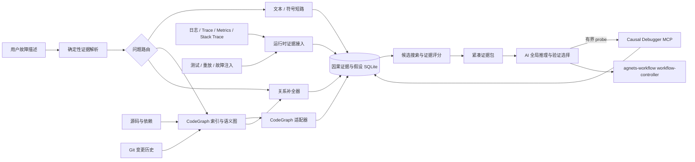

# Causal Debugger（因果诊断器）设计

> 状态：只读可运行插件已实现；M-1 benchmark harness 已实现，正式 Gate 和生产级能力尚未放行。  
> 目标形态：独立 Codex plugin + MCP server + Skill。  
> 当前仓库集成边界：复用 `agnets-workflow` 的任务编排能力，但不把因果分析逻辑放入 `workflow-controller`。

## 当前实现与未完成项

当前已经具备可运行的只读闭环：`causal_status` 检查 CodeGraph 索引，`causal_analyze` 在有界范围内合并代码关系、日志/堆栈证据、RTK 压缩结果、多假设评分和反事实字段，并通过本仓库 marketplace 与平台安装器提供给 Codex。它的目标是让模型一次获得高密度、可追溯的全局证据，而不是替模型保证根因正确。

当前实现已补齐几项容易造成误判的边界：静态邻域在固定预算内同时展开上游和下游关系；同一 `traceId`/`requestId` 且有有效时间戳的运行时事件生成 `observed` 的时间顺序边；排序分将运行时支持、干预提升和未解决关系缺口分开；没有干预证据时反事实结果明确返回 `unknown`；CodeGraph 的变更文件、构建信息和 watcher 降级状态会进入索引健康门；图邻域截断、未覆盖 seed、位置映射失败和 RTK 受限原始降级会进入最终分析包。

仍未完成、因此不能宣称“生产级全局根因引擎”的部分是：

- 独立 holdout 上至少 20 个历史 Bug、3 个仓库、6 类问题、每例 3 次重复和 fixed regression 的正式 Gate；
- 跨服务、数据库、消息队列和配置边界的可靠关系建模与症状映射；
- CodeGraph SDK 依赖在真实用户安装环境中的自动安装/升级验证；
- 生产观测连接器、主动 probe、自动修复和写入能力（当前刻意保持只读）。

这些是能力边界，不代表当前实现缺少可运行闭环；当前版本可以用于受控试用和继续收集证据，但正式发布仍以 Gate 结果为准。

## 1. 结论与范围

`Causal Debugger` 先把 Stack Trace、错误码、文件/行号、SQL 标识符、端点和配置键解析为确定性证据，再按问题类型选择文本/符号短路、CodeGraph 有界子图、关系补全器或运行时证据图。AI 接收压缩后的证据包，负责全局解释、比较假设和选择验证，不负责从整个仓库开始逐文件搜索或凭空生成基础图。

不是每个问题都需要构建同一种大图。精确局部问题应直接定位；调用与影响问题使用 CodeGraph；事件生命周期、资源边界和“缺少某种保护”等问题由关系补全器发现；跨服务问题必须依赖 Trace、日志或重放证据。

“因果图”必须区分证据强度：静态代码只能证明潜在影响关系；运行时只能证明在某个时间窗口观察到的关系；只有测试、重放、故障注入或其他干预验证后，关系才可以标记为已确认。未满足条件时不能输出确定性根因。

## 2. 目标与非目标

### 2.1 目标

- 在代码库变化后增量更新节点、边和搜索索引。
- 从模糊故障描述中定位症状节点，并在有界预算内反向搜索上游候选根因。
- 并行维护多个假设，输出支持证据、冲突证据、缺失证据和推荐 probe。
- 为每条边和每个假设提供可解释的排序分与置信等级。
- 输出稳定的节点、文件、行号、Trace ID 和日志引用，减少 AI 读取无关源码。
- 允许修复后的验证结果反馈到历史数据，用于后续排序校准。

### 2.2 非目标

- 不承诺仅凭静态代码推断真实运行因果。
- 不把相关性自动升级为因果性。
- 不枚举所有路径，也不让 AI 在没有预算的情况下无限扩散搜索。
- 不要求简单、可精确定位的问题先经过全图扩散。
- 不在默认模式下重启服务、修改生产配置、清理缓存或执行其他高影响动作。
- 不替代 `workflow-controller` 的 DAG、写锁、checkpoint、恢复和末端审核。
- 当前实现不自行实现通用语言解析器或第二套调用图；静态语义图复用受管 `CodeGraph` 的公开 SDK。关系补全器可以在有界文件范围读取源码和 CodeGraph 节点，但只能提取已经定义、可测试的领域关系，不能退化为另一套全语言解析器。
- CSS/SCSS 以及 CodeGraph 不支持的文件类型不纳入当前实现；遇到这些文件时明确返回 `unsupported_file_type`，不伪造调用、资源或配置关系。

## 3. 核心模型

### 3.1 三类关系

| `edge.status` | 来源 | 能证明什么 | 不能证明什么 |
| --- | --- | --- | --- |
| `potential` | AST、语言服务、依赖和配置分析 | 源码结构上存在可能影响 | 该关系在本次故障中实际发生 |
| `observed` | 日志、Trace、Metrics、Stack Trace、测试结果 | 某时间窗口内观察到关联或传播 | 没有混淆变量，也不代表干预后仍成立 |
| `confirmed` | 重放、故障注入、对照测试、人工确认 | 在指定环境和条件下获得干预证据 | 所有环境、所有版本都成立 |

关系还应带 `kind`，例如 `call`、`data_flow`、`config`、`http`、`message`、`db`、`event`、`lifecycle`、`guard`、`temporal`、`test_coverage` 和 `correlation`。`correlation` 只能作为辅助证据，不能直接作为因果边。

### 3.2 图不是永远的 DAG

服务重试、缓存失效、消息回流和监控反馈可能形成循环。底层使用普通有向图；对单次 Trace 或明确时间窗口，可以生成时间展开后的 DAG 快照供路径推理和可视化使用。所有分析结果都绑定 `snapshot`，避免代码或证据变化后继续使用旧图。

### 3.3 节点和边的最小形状

```json
{
  "node": {
    "id": "symbol:src/order/order-service.ts:reserveStock",
    "type": "function",
    "label": "reserveStock",
    "location": { "path": "src/order/order-service.ts", "line": 42 },
    "metadata": { "service": "order-api", "language": "typescript" }
  },
  "edge": {
    "source": "symbol:src/order/order-service.ts:reserveStock",
    "target": "db:inventory.reserve",
    "kind": "db",
    "status": "potential",
    "strength": 0.78,
    "evidence_refs": ["index:ts-compiler:991"]
  }
}
```

`strength` 是排序输入，不是未经校准的概率。证据引用必须可追溯到索引记录、日志行、Trace span、测试或变更记录。

### 3.4 假设对象

```json
{
  "root": "state:db.connection_pool.exhausted",
  "score": 0.82,
  "confidence": "high",
  "paths": [
    "pool exhausted -> request queueing -> API timeout -> user error"
  ],
  "supporting_evidence": [],
  "conflicts": [],
  "missing_evidence": [],
  "next_probes": []
}
```

`confidence` 只有在有校准数据时才可以映射为概率；否则使用 `low`、`medium`、`high` 等置信等级，并同时公开排序分的定义和证据缺口。

### 3.5 缺失关系不是普通边

“没有错误监听”“没有校验”“没有事务边界”无法从现有调用边直接推出。分析器使用单独的关系缺口对象记录预期、观测范围和未知项，不能伪造一条实际存在的 `guard` 边：

```json
{
  "finding": {
    "type": "missing_relation",
    "subject": "symbol:backend/src/modules/chat/chat.routes.ts:prepareSseResponse",
    "expected_kind": "guard",
    "expected_target_capability": "response_error_boundary",
    "observation": "absent",
    "scope": { "max_call_depth": 2, "snapshot": "git:4c96885" },
    "evidence_refs": ["source:chat.routes.ts:1197", "codegraph:query:guard-provider"],
    "unknowns": []
  }
}
```

如果调用深度、动态分派、反射或索引状态导致无法证明不存在，`observation` 必须为 `unknown`，不能报告 `absent`。

每次分析还必须返回覆盖声明，避免把“没有找到”写成“确定不存在”：

```json
{
  "coverage": {
    "analyzed_files": 1706,
    "relation_kinds": ["call", "event", "lifecycle", "guard"],
    "active_enrichers": ["node-http-sse-lifecycle@0.1.0"],
    "unsupported_or_unchecked": ["dynamic event names", "reflection", "cross-process transport"],
    "max_call_depth": 2,
    "truncated": false,
    "unknown_findings": 3
  }
}
```

`coverage` 只能描述本次实际执行的范围，不能把 CodeGraph 的语言支持清单等同于关系完整度。

## 4. 系统架构



### 4.1 CodeGraph：静态语义图的主后端

当前实现不重新扫描源码来重建通用调用图或维护第二套函数级静态索引。它复用项目已经受管安装的 `@colbymchenry/codegraph@1.5.0` 的公开 SDK，并读取同一个项目级 `.codegraph/` 索引。该版本的公开类型声明提供 `CodeGraph.open`、`getNode`、`getIncomingEdges`、`getOutgoingEdges`、`traverse`、`getCallers`、`getCallees`、`getImpactRadius`、`findPath`、`findRelevantContext`、`getIndexState`、`isIndexStale` 和 `getPendingFiles` 等能力。

`causal-debugger` 只通过 SDK 访问 CodeGraph，不读取或写入 `.codegraph/codegraph.db` 的私有表结构。这样 CodeGraph 升级时，适配器只需按公开 API 契约验证，而不会与其 schema、迁移、WAL 或文件锁实现耦合。

```text
CodeGraph 节点/边/索引状态
  -> CodeGraphAdapter（转换、版本检测、去重、来源标记）
  -> Causal Graph（potential 静态边 + runtime/confirmed 证据叠加）
  -> Hypothesis Engine（路径搜索、评分、probe 推荐）
```

`CodeGraphAdapter` 必须保留原始 `node.id`、`edge.kind`、`edge.provenance`、文件路径、行号、CodeGraph 版本和索引 snapshot。其输出一律标记为 `potential`，不因 CodeGraph 能解析跨文件调用就升级为 `observed` 或 `confirmed`。

首轮黑盒验收表明：TypeScript、JavaScript 和 Rust 的样本调用链可用，Go 同包调用可连出但静态解析置信较低，Java 静态限定调用可用而 `new Type().method()` 形式目前只稳定产生 `instantiates` 边。Java 实例调用、同名类型消歧必须在适配器回归测试中单独验证；无法唯一定位时输出 `partial`/`unknown`，不得伪造完整 `calls` 边。详细证据见 [`CodeGraph验收测试报告.md`](CodeGraph验收测试报告.md)。

真实项目验证进一步表明：直接将模糊中文问题传给 `buildContext`，两个历史 Bug 均未召回生产真值文件。CodeGraph 因此只作为结构 Provider，不作为唯一的自然语言召回器或根因排序器。关系补全器可以使用其调用边传播已识别的能力，例如把共享 response error guard 传播到调用该 helper 的 SSE 路由。详细证据见 [`因果诊断器真实项目可行性验证.md`](因果诊断器真实项目可行性验证.md)。

CodeGraph 的项目配置、安装、首建索引、索引修复和受控升级仍由 `$agent-toolchain` 负责。`causal-debugger` 在静态图不可用、`partial`、`failed`、过期或存在待同步文件时返回结构化前置条件错误和诊断信息；它不得绕过 `$agent-toolchain` 直接初始化、重建或修改既有 `.codegraph/` 索引。

索引新鲜度不能只依赖 `getPendingFiles()`：SDK 在 watcher 未启动时可能返回空列表，即使 `getChangedFiles()` 已经检测到文件修改。健康门必须联合检查 `getIndexState()`、`getIndexBuildInfo()`、`isIndexStale()`、`getChangedFiles()`、`getPendingReferenceCount()` 和 watcher 降级状态。

#### SDK 依赖与版本契约

全局受管的 `codegraph` CLI 已能维护项目索引，但 Node 的全局安装位置不是插件进程可安全 `import` 的契约。`causal-debugger` 因此应在自己的 `package.json` 中声明精确的 `@colbymchenry/codegraph@1.5.0` 依赖，并由 lockfile 固定解析结果；它使用该 SDK 打开同一个 `.codegraph/`，不再安装或启动第二套索引器。

这带来一次受控的包依赖，而不是第二套解析实现。CodeGraph 版本变更必须同时修改 `$agent-toolchain` 的受管 manifest、`causal-debugger` 的依赖和 SDK 适配器集成测试；任何一项未通过时拒绝启动静态图分析，不采用全局 `node_modules` 路径、私有 SQLite schema 或不固定版本的动态加载作为 fallback。

### 4.2 确定性解析、路由与关系补全

输入解析按确定性强弱生成 seed：

1. Stack frame、`path:line:column`、完整符号 ID；
2. 错误码、SQL 表/列、HTTP route、配置键和环境变量；
3. 结构化日志字段和 Trace span；
4. 最后才使用自然语言关键词和语义相似度。

路由器根据 seed 和问题特征选择最小充分路径：

| 路径 | 适用场景 | 默认行为 |
| --- | --- | --- |
| 文本/符号短路 | 精确 SQL、文件行号、唯一错误码 | 返回小范围源码和直接引用，不扩图 |
| CodeGraph 子图 | 调用者、被调用者、影响范围 | 使用节点 ID、深度、数量和时间预算 |
| 关系补全器 | 事件、生命周期、资源边界、缺失 guard | 建立能力清单，沿 CodeGraph 做有界传播 |
| 运行时证据图 | 跨服务、消息、竞态、动态注册 | 依赖 Trace/日志/重放；无证据时保留 unknown |

关系补全器不是通用正则扫描器。每个补全器必须定义支持的语言/框架、正例、缺失例、共享 helper 间接满足例、unknown 条件、最大传播深度和证据引用。第一批只考虑由真实事故证明必要的 HTTP/SSE lifecycle、async rejection/event、SQL/transaction、config/env 和 message pub/sub 关系。

### 4.3 语言支持策略

当前实现的语言范围等于受管 `@colbymchenry/codegraph@1.5.0` 运行时 `getSupportedLanguages()` 返回的全部语言。适配器不自行识别、解析或补写这些语言；插件启动时读取运行时清单，并按当前 workspace 的实际索引结果报告覆盖范围。

当前版本公开清单为：

```text
typescript, tsx, javascript, jsx, python, go, rust, java, c, cpp, csharp,
php, ruby, swift, kotlin, dart, pascal, scala, lua, r, luau, objc, cfml,
cfscript, cfquery, cobol, vbnet, erlang, solidity, terraform, arkts, nix,
svelte, vue, astro, liquid
```

该清单只证明 CodeGraph 提供对应 grammar 和语言入口，不证明每种语言的跨文件解析、重载消歧、动态分派或框架路由完整。Causal Debugger 必须为清单中的每种语言执行统一的能力矩阵：语言检测、文件索引、节点定位、边类型、调用链、反向调用者、影响半径、路径查询、增量同步和错误/未知状态。

CSS/SCSS 不在 CodeGraph 支持清单内，明确排除在当前实现之外。插件不安装 PostCSS、Tree-sitter 资源 grammar 或其他第二套 CSS 解析器；这类文件只在 `causal_status` 中作为未支持文件类型报告，不进入静态因果图。

CodeGraph 的静态解析 metadata 中的 `confidence` 仍然只是引用解析提示。适配器必须将其保存为 `static_resolution_score`，不能直接当作因果概率；反射、代码生成、动态注册、模板运行时关系和跨服务关系由运行时证据层处理。

### 4.4 图存储与缓存

后续因果层实现使用 SQLite 保存因果层特有的数据：运行时证据、边状态提升记录、假设、评分明细、probe 和反馈。静态代码图仍留在 CodeGraph 自己的 SQLite 索引中；不复制全部节点和边，不引入 Neo4j 等独立图数据库。

索引和分析缓存放在用户级 Codex home 的 `causal-debugger` 专用状态目录，按 workspace hash 隔离；不会在项目中生成 SQLite、WAL、日志或审查 JSON。具体路径由实现时的 MCP 运行环境派生，调用方不能任意指定存储目录。

### 4.5 运行时证据接入

接入器必须保存证据类型、来源、时间窗口、服务/版本、Trace ID（若有）和脱敏状态。原始日志和请求响应需要大小上限；脱敏失败时丢弃正文，只保留安全元数据和失败原因。

### 4.6 候选分析器

分析器不做全图路径枚举，执行以下有界流程：

1. 从确定性证据解析器获得 seed，并记录无法解析的输入。
2. 路由局部问题、结构问题、关系缺口问题和运行时问题。
3. 对需要扩图的 seed 沿有界反向边搜索上游节点。
4. 以 Beam Search 或等价的 Top-K 策略保留有限假设。
5. 汇总静态、关系缺口、运行时、测试、变更和先验证据。
6. 剪掉覆盖率低、冲突多、路径过长或超过预算的分支。
7. 返回根因候选、路径、证据缺口、截断状态和信息增益最高的 probe。

### 4.7 全局根因因果引擎

全局根因引擎的职责不是让模型重新搜索整个仓库，而是把一次事故的所有可用证据编译为一个**有界、高召回、可追溯的问题子图**。AI 只接收这个子图和排序后的假设，负责解释、比较和选择验证动作。

#### 4.7.1 输入与统一证据包

引擎把输入规范化为 `IncidentBundle`，每条证据都带来源、时间窗口、snapshot 和引用：

```json
{
  "symptoms": [{"id": "symptom:api-timeout", "text": "请求超时", "refs": ["log:run-1:42"]}],
  "stack_frames": [{"file": "backend/src/routes.ts", "line": 120, "symbol": "handleRequest"}],
  "runtime_evidence": [{"type": "log", "trace_id": "abc", "timestamp": "...", "message": "..."}],
  "codegraph_snapshot": "git:4c96885",
  "scope": {"workspace": ".", "max_files": 300, "max_depth": 3}
}
```

统一包中的节点类型至少包括 `symptom`、`event`、`state`、`component`、`function`、`config`、`resource`、`request` 和 `test`；边必须标记 `kind`、`evidence_level`、`strength`、`refs` 和 `observation`。静态 CodeGraph 边只能是 `potential`，日志/Trace 边是时间窗口内的 `observed`，测试、重放或故障注入支持的边才可标记 `confirmed`。

#### 4.7.2 一次性全局构图算法

构图采用固定预算的多源反向 Beam Search，而不是全图枚举：

1. 从 Stack Trace、错误码、日志字段、Trace ID、端点、SQL 和配置键生成多个 seed；无法解析的自然语言只作为低权重 seed，并记录解析缺口。
2. 对每个 seed 从 CodeGraph 获取调用者、被调用者、影响半径和依赖节点，深度默认 2，复杂事故最多 3；每层只保留 beam width `B` 个候选。
3. 运行已注册的关系补全器，生成事件监听、async rejection、配置覆盖、资源上限、事务边界和缺失 guard 等“虚拟缺口边”。缺口边必须单独标记 `missing_relation`，不能伪装成真实调用边。
4. 用日志/Trace 的时间、请求、进程、线程和服务键把静态节点连接成运行时边；跨服务没有 Trace 或明确相关 ID 时只能产生 `unknown`，不能按文件名相似度连边。
5. 合并重复节点和边，保留所有引用；达到节点、边、深度或时间预算时返回 `truncated=true` 和未覆盖 seed，不静默丢弃。

在固定 beam width 和深度下，复杂度近似为 `O(S · B · D · (degree + R))`，其中 `S` 是 seed 数、`D` 是最大深度、`R` 是关系补全器数量；它不会随整个仓库文件数线性膨胀。CodeGraph 查询、关系补全和日志压缩都在本地完成，目标是在中型仓库秒级生成首个全局 packet。

#### 4.7.3 多假设与反事实排序

每个候选根因是一条或多条从根节点到症状节点的路径。引擎保留至少 `K=3` 条相互独立的假设，避免第一个关键词命中把模型锁死。初始排序分使用可解释的归一化特征：

```text
score(H) = 0.15 * prior
         + 0.20 * symptom_coverage
         + 0.15 * temporal_support
         + 0.15 * structural_path_support
         + 0.20 * runtime_support
         + 0.10 * intervention_or_replay_lift
         - 0.20 * contradiction
         - 0.15 * unresolved_critical_gap
```

这些权重是排序默认值，不是概率；上线前必须用 holdout 事故集校准。输出中的 `confidence` 只是未校准的证据等级：只有干预/重放提升且冲突、缺口受控时才可标记为 `high`，没有运行时或干预证据时保持 `low`。反事实检查在图上执行“移除候选根因节点/边并重新计算症状覆盖”：如果移除后所有高分路径都断开，记录 `counterfactual_support=high`；如果仍存在独立路径，降低该假设分数并保留替代假设；没有足够证据模拟时返回 `unknown`。这不是对生产系统的真实干预，不能把模拟结果标记为 `confirmed`。

输出至少包含：Top-K 假设、每条路径的节点/边、支持证据、冲突证据、缺失证据、反事实结果、覆盖范围、截断状态和推荐 probe。这样 AI 第一次请求就获得“全局候选 + 为什么 + 还缺什么”，通常只需一次解释调用和零到两次窄 probe。

#### 4.7.4 日志、控制台与 RTK 压缩管线

日志处理分为“压缩”和“因果解析”两步，不能把二者混为一谈：

```text
原始日志/console 输出
  -> 大小与时间窗口限制（流式读取）
  -> rtk log / rtk pipe 去重、过滤、折叠重复噪声
  -> 结构化字段解析（timestamp、level、service、request/trace、error code）
  -> 时间排序与 Trace/请求关联
  -> 生成 observed 事件边、冲突和 unknown
  -> 合并到全局因果子图
```

受管工具实际名称为 `rtk`（当前版本 `0.44.1`）；`rtk log` 适合压缩文件或标准输入中的重复日志，`rtk pipe` 适合已有过滤器的管道，`rtk rg` 适合先做窄范围匹配。RTK 只是输出压缩器，不理解业务因果，也不保证保留每一行；因此每个压缩片段必须保存原始文件摘要、行号/偏移窗口和 SHA-256。压缩失败、字段解析失败或 RTK 不可用时，保留原始错误并降级为受限窗口读取，不把不完整摘要报告为完整日志事实。

运行时适配器会从日志/控制台/堆栈文本提取 `file:line[:column]`，通过 CodeGraph 公共 API 的 `getNodesInFile` 选择覆盖该行的最窄节点。映射成功的事件生成 `runtime_observation` 观测边（`observed`）；无法定位、路径越出 workspace 或索引中没有对应节点的事件进入 `unknownFindings`，不得猜测绑定到相邻函数。该映射只提升“观测支持”，不会把静态 CodeGraph 边升级为 `confirmed`。

控制台打印通常没有稳定 schema：若缺少时间戳、请求 ID 或服务名，只能作为低强度 `observed` 证据；相同文本跨进程出现时不得自动合并。日志正文先脱敏，Authorization、Cookie、token、密码和连接串永不进入 packet；脱敏失败则丢弃正文，只保留安全元数据与失败原因。

#### 4.7.5 AI 一次性上下文契约

发送给 AI 的 packet 固定分为四层：`incident_summary`（症状和范围）、`causal_graph`（节点/边引用）、`hypotheses`（Top-K 支持/冲突/反事实）和 `unknowns_and_probes`（证据缺口与最多两个 probe）。默认不发送完整仓库和完整日志；AI 只能通过引用请求局部源码或运行时窗口。packet 生成器必须报告字符数、实际 token（若 provider 提供）、截断原因和每条关系的 `relationId`，以便验证“更多相关上下文”是否真的提高召回，而不是单纯增加噪声。

## 5. 评分机制

初始排序可以使用以下可解释模型：

```text
score(H) = prior(H)
         + runtime_support(H)
         + path_coverage(H)
         + reproduction_lift(H)
         - contradiction(H)
         - missing_evidence(H)
```

建议将各项拆成可审计的特征，而不是在代码中隐藏一个无法解释的总分：

- `prior`：当前仓库或历史事故中的先验，不直接硬编码通用经验。
- `runtime_support`：时间顺序、Trace 传播、指标变化和日志匹配。
- `path_coverage`：假设路径能解释多少已知症状。
- `reproduction_lift`：干预或重放前后故障率的变化。
- `contradiction`：与已知事实冲突的证据。
- `missing_evidence`：尚未验证但决定性的重要观测。

没有标注数据时，结果只能称为“排序分”。积累已知根因后，使用历史事故集做概率校准，并单独评估 Top-K 命中率、校准误差和错误自信率。

## 6. MCP 接口草案

插件名固定使用 `causal-debugger`，显示名为 `Causal Debugger（因果诊断器）`。建议提供以下小而明确的工具：

| 工具 | 默认副作用 | 作用 |
| --- | --- | --- |
| `causal_index` | 写入全局因果缓存 | 从健康的 CodeGraph 索引物化所需子图；不初始化、重建或修改 `.codegraph/` |
| `causal_status` | 只读 | 返回 CodeGraph 版本、索引健康度、支持语言、覆盖范围、失效原因和更新时间 |
| `causal_ingest` | 写入全局证据 | 导入日志、Trace、Metrics、Stack Trace 或测试结果 |
| `causal_analyze` | 只读 | 输入症状和范围，返回 Top-K 假设与证据子图 |
| `causal_expand` | 只读 | 展开指定节点、边或路径，按预算返回引用 |
| `causal_probe` | 默认只读 | 生成或执行有限验证动作；重启、写配置等高影响动作必须单独授权 |
| `causal_feedback` | 写入历史标注 | 记录最终根因、验证结果和误判原因 |

`causal_analyze` 的返回值必须包含 `analysis_id`、`snapshot`、症状节点、假设列表、图节点/边、关系缺口、`coverage`、未知项、截断状态和推荐 probe。默认只返回引用和短摘要，不把完整源码塞进模型上下文。

## 7. Skill 工作流

`$causal-debugger` Skill 约束 AI 采用以下顺序：

1. 调用 `causal_status`，确认 CodeGraph 索引存在、完整、未过期且没有待同步文件。
2. CodeGraph 不可用或不健康时停止静态分析，按 `$agent-toolchain` 的受控接入/维护流程恢复；不得让 AI 重新扫描全仓库来伪造等价索引。
3. 必要时调用 `causal_index`，物化本次分析所需的静态子图。
4. 调用 `causal_analyze`，先获得全局候选图。
5. 只读取返回节点和证据引用对应的代码范围。
6. 置信度不足时，选择一个信息增益最高且风险可控的 `causal_probe`。
7. 候选路径收敛后再修改代码，并运行与改动相称的验证。
8. 调用 `causal_feedback` 记录最终结果。

复杂任务可将 `index -> analyze -> probe -> targeted-fix -> verify -> review` 映射到现有 `workflow-controller`。控制器只管理任务状态、执行者、写锁、checkpoint 和审核，不修改 `causal-debugger` 的图结论。

## 8. 数据与安全边界

- 默认只分析用户声明的 workspace 和输入证据范围。
- 索引、证据和缓存按 workspace hash 隔离，路径必须做 canonicalization 和越界检查。
- 日志、Trace 和请求响应先脱敏；禁止保存完整 token、Cookie、Authorization、密码和连接串。
- 所有边和假设保留来源引用、时间和 snapshot；证据不足时返回 `unknown`，不得静默 fallback 为确定结论。
- MCP 只读分析与高影响 probe 分开；生产写入、重启、配置修改、缓存清理和回滚必须保留明确授权门。
- 大型日志使用流式或窗口读取，不能为了分析把完整文件一次性加载进内存。

## 9. 性能与 token 目标

这些是正式验收目标，不是当前实现事实：

- 未变化 workspace 的 `causal_status` 应为常数时间级查询。
- CodeGraph 负责增量索引和文件监听；`causal-debugger` 只按 snapshot 物化本次候选子图和因果证据，目标是在中型仓库内达到秒级反馈。
- 冷索引、warm 查询和增量同步分别计时；“秒级”只描述已有健康索引的 warm 分析。首轮真实项目中，CodeGraph CLI 内部冷索引为 4.0 至 5.4 秒，完整命令墙钟可能超过 15 秒。
- `causal_analyze` 使用固定节点数、边数、路径深度和时间预算；超限时返回明确的截断信息。
- AI 上下文只包含证据包、短代码片段和引用，避免注入完整仓库。
- 分析结果可由 `snapshot + normalized_input + analyzer_version` 缓存和复用。

每轮评估记录：首次返回候选的延迟、首次可观察正确根因时间、Top-1/Top-K 根因命中率、关键关系召回率、实际 input/output/cache token、工具调用次数、读取字符数、索引过期率、误报自信率和未解决证据缺口率。若模型运行时只暴露最终消息，该时间只能是最终结构化候选的墙钟时间，不能声称测得内部思考中的首次命中。字符数除以 4 只能标记为 token 代理值，不能替代实际模型用量。证据包必须固定原始字节的 SHA-256；确定性证据层的关系召回依据冻结包中的规范化 `claims` 审计，模型关系召回则单独和同一真值比较，两者不得混用。正式 `gate` 在冻结前为每条关键关系分配稳定 `relationId`，模型复述该关系时必须原样保留 ID；评分按 ID 匹配并保留 source/target/kind 精确召回作为诊断指标，禁止运行后用别名规则制造命中。每个 claim 所引用的仓库文件必须在 packet 内容中可追溯，不能把模型自由生成的关系字符串或人工标注当作 packet 命中。

## 10. 分阶段计划

### M-1：真实事故盲测与放行

- 建立至少 3 个仓库、20 个历史 Bug 的固定快照和隐藏真值；
- 分离规则设计集和最终 holdout 集；评估期间不得读取修复提交或把同一事故用于规则设计和最终计分；
- 使用相同模型、提示词、推理强度、预算和超时，以随机顺序对比普通排错与证据包辅助排错，每个样本每条路径至少重复 3 次；
- 实现可丢弃的确定性输入解析器、路由器，以及 1 至 2 个关系补全器 Spike；
- 记录根因/关系召回、首次正确根因时间、实际 token、工具调用和修复后误报；
- 达到 [`因果诊断器真实项目可行性验证.md`](因果诊断器真实项目可行性验证.md) 的 Go/No-Go 门槛后，才允许进入 M0。

### M0：CodeGraph 适配与静态影响图

- 固定适配 `@colbymchenry/codegraph@1.5.0` 的公开 SDK，不读取私有 SQLite schema；
- 对 `getSupportedLanguages()` 返回的全部语言建立集成样本或明确不可构造原因，并验证同一适配器读取 CodeGraph 节点、边、调用链和路径；Java 样本必须同时覆盖限定静态调用、实例调用和同名类型消歧，未覆盖时不得宣称 Java 调用链完整；
- 验证 `CodeGraph.open(..., { readOnly: true, sync: false })`、索引完整性、过期检测和待同步文件的失败路径；
- 只存储因果层证据和评分，不复制完整静态代码图；
- 实现文本/符号短路、问题路由和已通过 M-1 的关系补全器，不把所有输入直接交给 `buildContext`；
- `causal_index`、`causal_status`、`causal_analyze`；
- 输出 `potential` 图和可追溯文件/行号。

### M1：运行时证据

- Stack Trace、结构化日志和 OpenTelemetry 导入；
- 时间窗口与 Trace 传播边；
- 冲突证据、缺失证据和 Top-K 假设；
- `$causal-debugger` Skill 的有界读取流程。

### M2：验证与校准

- 测试/重放 probe；
- 反事实结果记录；
- `causal_feedback` 和历史事故标注；
- 基于真实事故集的分数校准和回归评估。

跨仓库拓扑、生产观测连接器和复杂故障注入放在当前实现之后，除非有明确用户场景和验证数据。

## 11. 验收标准

实现完成后至少提供以下证据：

- 同一 workspace 首次索引和增量索引均有可重复命令及耗时记录；
- `causal-debugger` 能在不读取 `.codegraph/codegraph.db` 私有表的条件下，通过公开 SDK 获取节点、边、调用链和路径；
- 对 `getSupportedLanguages()` 返回的全部语言各有一个最小集成样本或明确的不可构造原因，验证节点定位、边类型、调用路径和错误状态；
- CodeGraph 索引缺失、`partial`、`failed`、过期或存在待同步文件时，`causal_status` 返回明确原因，且 `causal_analyze` 不把静态图当作完整事实；
- CodeGraph 清单之外的文件类型（包括 CSS/SCSS）返回 `unsupported_file_type`，且不会被关键字或第二套解析器加入静态图；
- 对代表性故障样本，`causal_analyze` 返回可追溯的症状节点、至少两个候选假设、支持/冲突/缺失证据；
- 精确局部问题可以走文本/符号短路，并证明扩图没有带来额外真值时不会默认扩图；
- 每个关系补全器都有正例、缺失关系例、共享 helper 间接满足例和 `unknown` 例，修复后不会继续报告同一关系缺失；
- 静态关系、运行时关系和干预确认关系在输出中可区分；
- 超出节点、路径或时间预算时返回明确的截断状态，不静默返回完整结论；
- Skill 不触发无界文件搜索，AI 能按证据包定位到目标代码范围；
- MCP 输入越界、证据脱敏失败、索引过期、解析失败和 probe 未授权均保留原始错误并停止；
- `workflow-controller` 集成只产生任务状态和审核证据，不在项目目录生成未声明的索引或运行状态文件；
- 完成至少 3 个仓库、20 个历史 Bug 的盲测；Top-3 根因命中率不低于 80% 且相对基线提高至少 15 个百分点，冻结证据包关系召回和 assisted 模型最终关系召回均不低于 85%，首次正确根因时间中位数下降至少 30%，实际输入 token 的 P75 下降至少 40%，高置信错误率不高于基线；
- warm 检索/分析延迟 P95 在约定中型仓库不高于 2 秒，冷索引耗时单独报告；
- 记录全部未达标项、截断状态、模型实际 token 和残余风险，不用 token 代理值代替最终验收。

## 12. 风险与待确认项

### 已知风险

- 动态语言的反射、代码生成和运行时注册会造成静态图不完整。
- 分布式时钟、重试和异步消息会削弱时间顺序证据。
- 先验错误或历史事故偏差会使排序分系统性偏移。
- 图过大时，节点和边数量本身会重新造成 token 和查询延迟压力。
- 关系补全器可能把“间接满足”误判为缺失，或因调用深度截断把 unknown 错写为 absent。
- 使用已知事故设计规则容易过拟合；必须用未参与规则设计的隐藏样本盲测。
- 日志和 Trace 可能包含敏感数据，脱敏策略必须先于广泛接入。

### 待确认项

- 首批必须支持的语言、框架和构建系统；
- 用户是否已有 OpenTelemetry、日志或测试结果的标准格式；
- `causal_probe` 允许的默认命令范围，以及哪些动作必须逐次确认；
- CodeGraph 受管安装版本升级时，是否由 `agent-toolchain` 与 `causal-debugger` 统一升级和重新验证 SDK 适配器；
- 全部 CodeGraph 支持语言的能力矩阵、最小样本和已知缺口；
- 代表性故障样本和最终根因标注来源；
- 关键关系真值的标注规则，特别是“不存在但应该存在”的关系；
- 目标仓库规模、可接受的首次索引时间和单次分析预算。

## 13. 计划实现的文件布局

```text
plugins/
└── causal-debugger/
    ├── .codex-plugin/plugin.json
    ├── .mcp.json
    ├── package.json
    ├── scripts/
    │   ├── indexer/
    │   ├── graph-store/
    │   ├── evidence/
    │   └── analyzer/
    ├── skills/
    │   └── causal-debugger/
    │       └── SKILL.md
    └── tests/
```

上述目录是目标结构；当前仓库已经存在只读插件、marketplace 条目和平台安装器接入。仍需按安装契约在真实用户环境验证依赖安装、缓存和启用状态。
