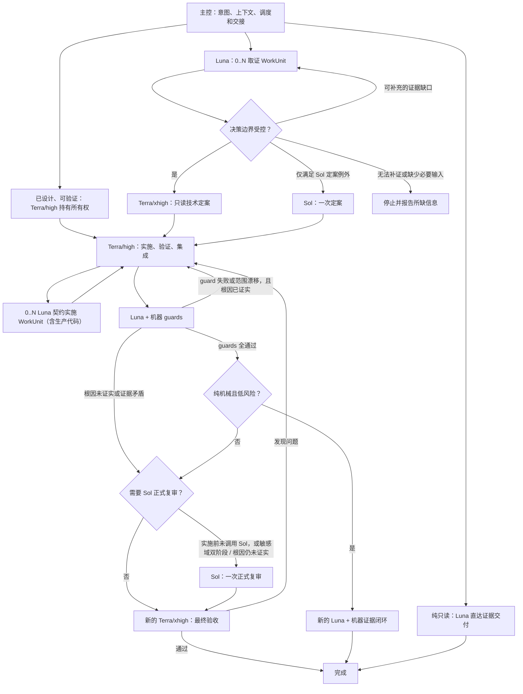

# 工作流设计说明

这是面向维护者的设计说明，不是运行时规范。模型路由、读写边界与验收以 [SKILL.md](../SKILL.md) 为唯一权威。

## 目标

让主控专注于理解意图、选择必要上下文和调度；将取证、定案、实施与独立复审分离。流程不以固定轮数或固定并发换取表面一致性，而以可验证的新增价值、所有权和验收决定是否扩展。

## 关键设计

### 单一权威与局部契约

`SKILL.md` 保留所有跨角色行为：路由、并发、交接与验收。role profile 只保留其可做与不可做的事，避免由十余份提示重复维护同一算法。README 解释工作流，计划模板记录某次任务状态，都不能改变实际路由。

### 最小充分交接

`HandoffPacket` 只交代目标与范围、`execution_state`、`result_state`、产物或验证证据，以及下一动作或阻塞；写入时再附 `ImplementationContract`、唯一所有权、验收和停止条件。它让下游执行或判断，不传递完整历史，也不模拟运行时调度状态。

### 结果可用性

执行实例的终态只说明该 WorkUnit 不再运行，不说明父任务已经满足验收。`execution_state` 与 `result_state` 分开：前者描述实例生命周期，后者描述结果能否用于补证、定案、执行、完成或报告真实领域受阻。接收节点将上游内容视为待核验输入：影响判断、行动或关闭的主张必须回到原始材料、约束和可观察结果独立确认；不成立或不足时回到补证，不能因为交接已发生就形成契约或完成任务。只有结果达到当前任务的 `verified_complete` 且证据满足验收，协调者才能关闭。

### 可扩展但不失控的并发

`WorkUnit` 是可独立验收的工作，而不是固定数量的子代理。探索按互补证据域、固定输入和可说明新增价值拆分；二级 writer 只处理互不冲突的目标。验收覆盖目标完成即停止，重复、矛盾或不可解释结果立即升级。反证或关键假设需要时可重叠，但必须有明确新增价值。写入所有权冲突时串行处理。

### 决策升级

纯只读任务由 Luna 直接交付证据。证据仍可补充时回到 Luna；缺少必要输入或无法补证时停止并报告，不得猜测。`Terra/xhigh` 用于证据充分、边界受控的技术判断和新的最终验收；它不是 writer。有界路径的实施后只保留 Luna/机器 guards 和一个新的 Terra/xhigh 最终验收。guard 或验证失败时交由父 `Terra/high` 按当前状态处理。根因未证实或证据矛盾才判断是否需要 Sol 正式复审。Sol 仅处理权限、安全或隐私合规、数据完整性、竞态、生产或不可逆外部副作用、公共契约或跨模块重设计、无可靠 oracle 的非确定性风险，以及证据矛盾或未证实根因；高影响本身不是 Sol 触发条件。默认每个任务只在定案或正式复审之一使用一次 Sol，只有敏感域双阶段判断或根因仍未证实时才可调用两次。

### 独立性

`Terra/high` 是唯一一级 writer，负责把设计转成 `ImplementationContract`、审查和集成二级 Luna 的实际结果。默认情况下，Luna/high 在契约内实施互斥的代码 WorkUnit；需要更深局部理解但仍不需要重新设计时才使用 Luna/xhigh。代码类型不是限制：契约可以覆盖生产逻辑、公共接口或 schema、迁移脚本，以及共享状态或并发相关实现。Terra 直接处理设计未定、契约缺口、共享所有权冲突、复杂集成、不可验证行为和 Luna 停止上报的例外；Luna 不自行作未交接的产品或架构取舍。Sol 做例外路径的一次独立定案或正式复审。语义改动或中高影响路径的最终验收使用新的 `Terra/xhigh` work unit；纯机械低风险路径仅在全部 guards 通过时，才使用新的 Luna 加机器证据闭环。

### 受阻与继续

WorkUnit 受阻时交付已完成结果和具体阻塞，普通暂态问题不转成用户确认。父 Terra 先核验实例、diff、产物和验证输出；实例失联或终止且工作未完成时，在当前回合创建一个带原契约的替代实例，并在 Handoff 记录被替代实例。每个 WorkUnit 生命周期至多替代一次；不能恢复时保留原始错误和缺失条件，并保持 goal active。

跨顶层重启时，主控先读取 `RecoveryManifest`，只恢复自己的直接一级 owner；替代一级 owner 再恢复自己的直接二级 writer。清单 revision、实例状态、替代计数和幂等 claim 让恢复不会重复创建 writer。状态提供者缺失、持久化失败、委派通道不可用或运行时无法唤醒时，只做一次最终盘点，进入 `recovery_required/runtime_wait` 并结束当前轮次；若 host 提供顶层任务控制器，则由控制器创建带清单的替代主任务。这不能伪装成领域阻塞，也不能在原任务内无限重复验证。

### 结果收敛

父角色消费每个终态结果一次；确认满足验收才能结束，其他结果继续路由。没有 Handoff 时依据输出、产物、diff 和验证证据判断；不能证明完成则至多替代一次或报告实际领域阻塞。若运行时未提供子任务终态唤醒或替代启动能力，投递、唤醒或替代启动失败保持 goal active，当前轮次进入 `runtime_wait` 并停止；提示词本身不能伪造队列、重试或 backoff。原始 provider 状态或枚举变化不应改变这些语义判断。

## 运行时限制

profile 的权限字段是声明的角色边界，而不是可从静态文件证明的运行时隔离。安装验证只能证明源规则已复制；实际委派是否遵守路由仍需通过宿主提供的委派记录或新任务的行为冒烟验证。
